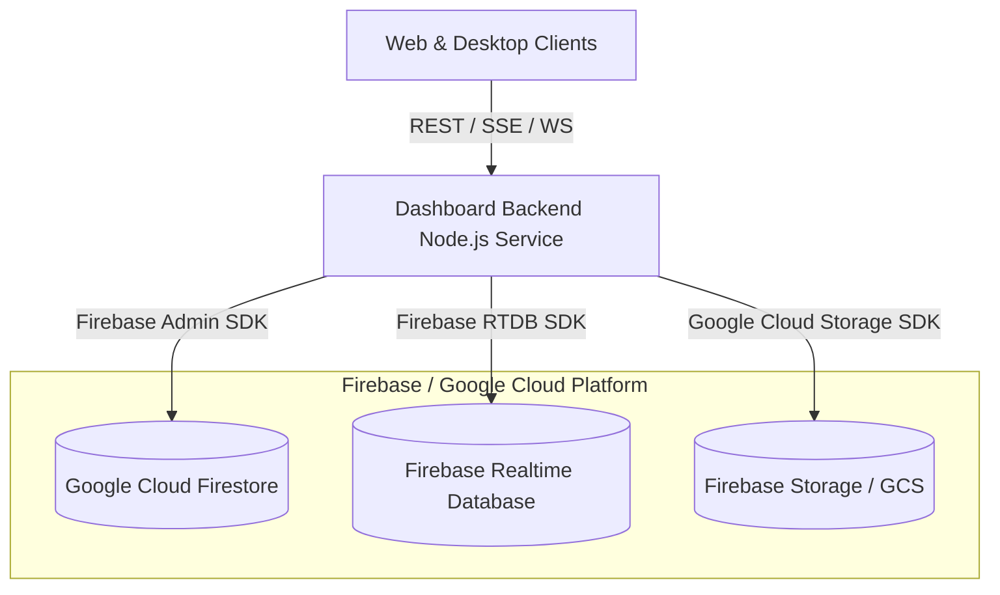
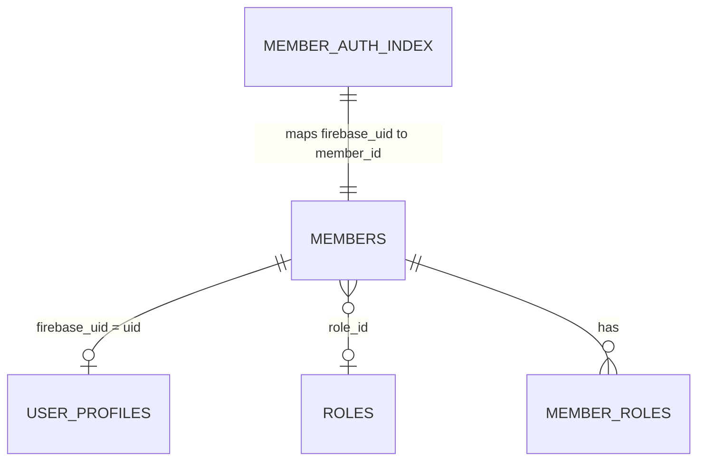
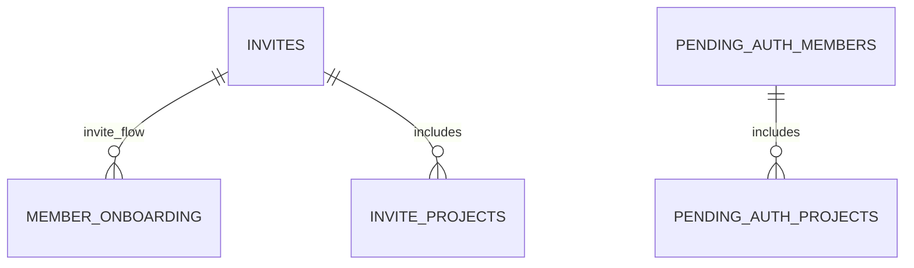
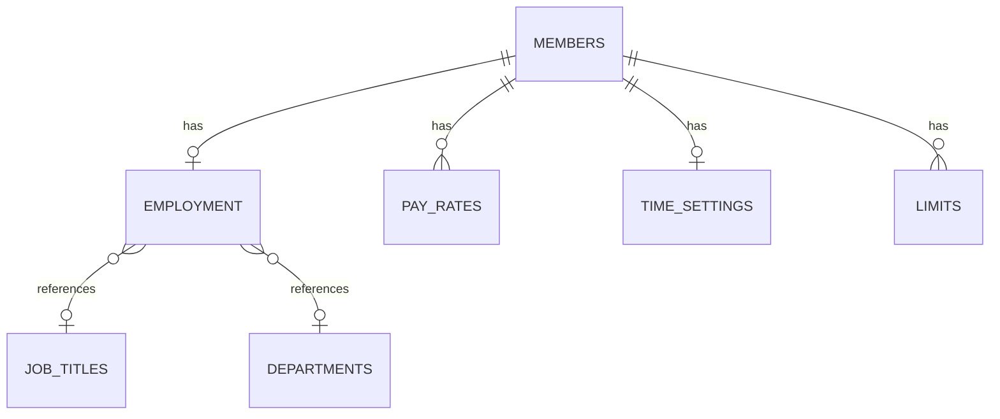
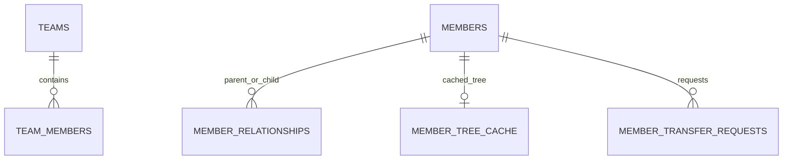
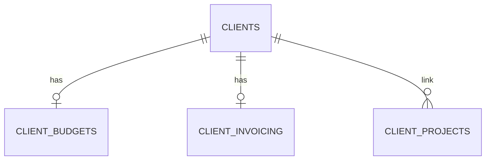
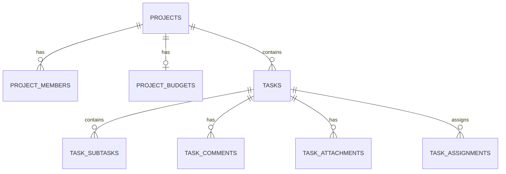
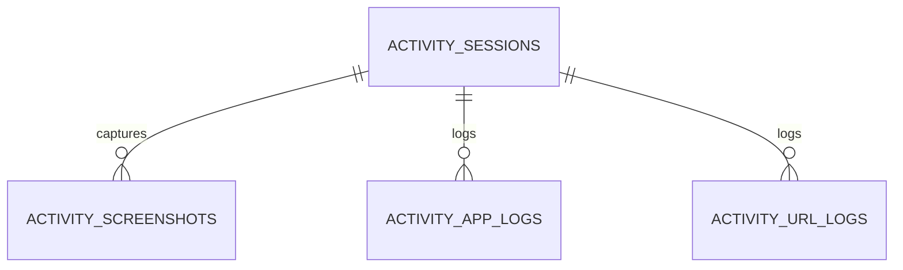
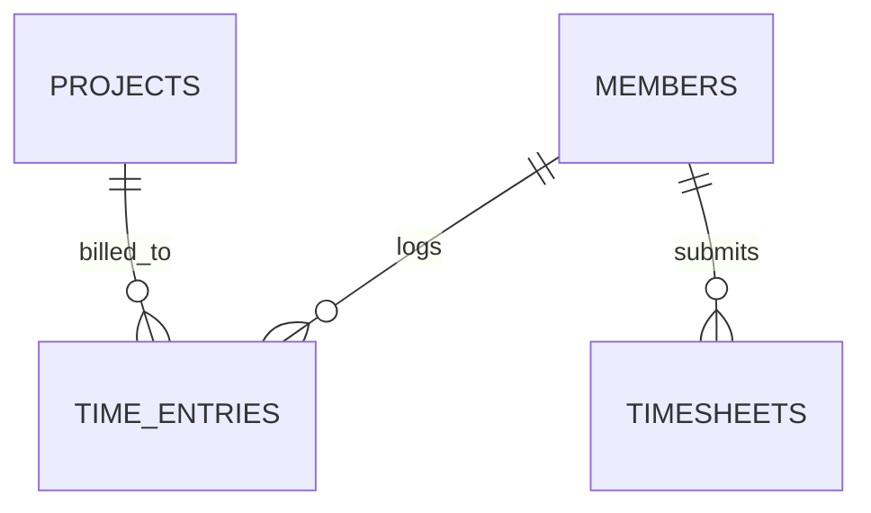

# Virtual Tracker — Database Schema & Data Layout

This document describes the database design, architecture, and data layout for the Virtual Tracker platform. It details how data is persistent, transiently synchronized, or stored across different database modes.

---

## 1. Database Architecture & Technology Stack

The Virtual Tracker platform utilizes a multi-mode database system designed for high availability, real-time sync, and rapid telemetry ingest.



### Stack Components

| Database Mode | Service Used | Purpose | Persistence Type |
| :--- | :--- | :--- | :--- |
| **NoSQL Document Store** | **Google Cloud Firestore** | Business entities, configuration, logs, and timesheets | Permanent (native cloud persistence) |
| **NoSQL Real-Time DB** | **Firebase Realtime Database (RTDB)** | Real-time presence heartbeats and connection states | Transient / Semi-persistent |
| **Blob / Object Storage** | **Firebase Storage / Google Cloud Storage (GCS)** | User profile avatars (legacy) and task file attachments | Permanent (object storage) |
| **SQL Database** | **None** | *Not used in this stack.* Relational concepts are modeled in Firestore. | N/A |

### Security & Access Control
- **Backend Enforced**: All access to databases is routed via the `Dashboard-Backend` service utilizing the **Firebase Admin SDK**.
- **Blocked Client Access**: Firestore security rules (`firestore.rules`) enforce a strict defense-in-depth policy blocking direct client SDK reads/writes:
  ```javascript
  rules_version = '2';
  service cloud.firestore {
    match /databases/{database}/documents {
      match /{document=**} {
        allow read, write: if false;
      }
    }
  }
  ```
- **Storage Rules**: Firebase Storage rules (`storage.rules`) restrict file reading to authenticated users and deny direct client uploads.

---

## 2. NoSQL Data Layout — Google Cloud Firestore

Firestore is the primary database for the Virtual Tracker backend. 

### Key Architectural Guidelines
- **Flat Layout**: All collections are stored as **top-level collections** (`db.collection(name)`). Nested subcollections (e.g. `members/{id}/time_settings`) are explicitly blocked (see [collections.js](file:///x:/Work/Virtual-Tracker-Test/Virtual-Tracker/Dashboard-Backend/src/lib/firestore/collections.js) → `INVALID_MEMBER_SUBCOLLECTIONS`) to prevent bandwidth overhead and simplify batch operations.
- **Foreign Key (FK) Tables**: Relationships are modeled using flat join collections (e.g., `project_members`, `team_projects`) rather than embedding nested maps or sub-documents.
- **Identifiers**: Primary keys are **UUID v4** strings, generated via `crypto.randomUUID()` at the catalog layer. The exceptions are auth-centric collections (`User_profiles`, `member_auth_index`, `pending_auth_members`) which use the string **Firebase UID** as their document ID.
- **Timestamps**: All dates and timestamps are stored as native Firestore `Timestamp` objects.
- **Case Conventions**: Fields in Firestore are stored in `snake_case`. The API layer parses inputs to support `camelCase` input aliases for frontend client compatibility.

---

### Domain Collections & Schemas

The Firestore tables are grouped below by logical business domain.

### Domain 1: Identity & Roles

Manage login credentials, user profiles, system roles, and permissions mapping.



#### 1.1 `members`
* **Firestore Collection**: `members`
* **Description**: Canonical representation of an organization member.
* **Fields**:
  * `id`: `uuid` (Primary Key)
  * `first_name`: `string` (Required)
  * `last_name`: `string` (Required)
  * `work_email`: `string` (Required, unique format)
  * `personal_email`: `string`
  * `employee_id`: `string`
  * `ip_address`: `string`
  * `status`: `string` (Required, must be `active`, `inactive`, or `paused`)
  * `role_id`: `uuid` (Foreign Key referencing `roles`)
  * `hierarchy_status`: `string`
  * `hierarchy_entitlements`: `object`
  * `privileges`: `object`
  * `independent_hierarchy`: `boolean`
  * `hierarchy_status_updated_at`: `timestamp`
  * `date_added`: `timestamp`
  * `created_by`: `uuid`
  * `updated_by`: `uuid`
  * `updated_at`: `timestamp`
* **Default Order**: `date_added` (Ascending)

#### 1.2 `User_profiles`
* **Firestore Collection**: `User_profiles`
* **Description**: Profile data synchronized from Firebase Auth. Stores avatar images directly to avoid GCS requests.
* **Fields**:
  * `uid`: `string` (Primary Key, matches Firebase User UID)
  * `primaryEmail`: `string`
  * `photoURL`: `string` (Legacy Storage/OAuth URL)
  * `profileImageData`: `text` (Decoded base64 data string of the uploaded avatar)
  * `profileImageMimeType`: `string` (e.g., `image/png`, `image/jpeg`, `image/webp`)
  * `profileImageUpdatedAt`: `timestamp`
  * `must_change_password`: `boolean`
  * `updatedAt`: `timestamp`

#### 1.3 `member_auth_index`
* **Firestore Collection**: `member_auth_index`
* **Description**: Utility index mapping Firebase authentication UID to internal system Member ID.
* **Fields**:
  * `firebase_uid`: `string` (Primary Key / Doc ID)
  * `member_id`: `uuid` (Foreign Key referencing `members`)
  * `updated_at`: `timestamp`

#### 1.4 `roles`
* **Firestore Collection**: `roles`
* **Description**: Predefined and custom organization roles (e.g., Owner, Admin, Manager, Employee, Viewer).
* **Fields**:
  * `id`: `uuid` (Primary Key)
  * `name`: `string` (Unique name)
  * `description`: `text`
  * `created_at`: `timestamp`
  * `created_by`: `uuid`
  * `updated_by`: `uuid`

#### 1.5 `member_roles`
* **Firestore Collection**: `member_roles`
* **Description**: Denormalized role assignment table. Simplifies member listings without deep joins.
* **Fields**:
  * `id`: `uuid` (Primary Key)
  * `member_id`: `uuid` (Foreign Key referencing `members`)
  * `role_id`: `uuid` (Foreign Key referencing `roles`)
  * `role_name`: `string` (Denormalized display name)
  * `member_name`: `string` (Denormalized member name)
  * `member_work_email`: `string` (Denormalized work email)
  * `assigned_at`: `timestamp`
  * `assigned_by`: `uuid`

#### 1.6 `access_requests`
* **Firestore Collection**: `access_requests`
* **Description**: Publicly submitted requests to join the organization workspace.
* **Fields**:
  * `id`: `string` (Primary Key)
  * `name`: `string`
  * `email`: `string`
  * `phone`: `string`
  * `source`: `string`
  * `createdAt`: `timestamp`

---

### Domain 2: Invites & Onboarding

Tracks registration links, guest user tokens, and onboarding checklists.



#### 2.1 `invites`
* **Firestore Collection**: `invites`
* **Description**: Workspace invites sent to external emails.
* **Fields**:
  * `id`: `uuid` (Primary Key)
  * `email`: `string` (Required, valid email format)
  * `role_id`: `uuid` (Foreign Key referencing `roles`)
  * `invite_token`: `string` (Unique token key)
  * `invite_kind`: `string` (e.g., `open_link`, `email`)
  * `firebase_uid`: `string` (Mapped upon acceptance)
  * `pay_rate`: `decimal` (Initial assigned rate)
  * `weekly_limit`: `string` (Initial weekly hour limit)
  * `currency`: `string`
  * `status`: `string` (Required: `pending`, `accepted`, `revoked`)
  * `sent_at`: `timestamp`
  * `accepted_at`: `timestamp`
  * `created_by`: `uuid`
  * `updated_by`: `uuid`

#### 2.2 `invite_projects`
* **Firestore Collection**: `invite_projects`
* **Description**: Maps which projects the invitee will be auto-assigned to upon registration.
* **Fields**:
  * `id`: `uuid` (Primary Key)
  * `invite_id`: `uuid` (Foreign Key referencing `invites`)
  * `project_id`: `uuid` (Foreign Key referencing `projects_VirtualTacker`)
  * `created_by`: `uuid`

#### 2.3 `pending_auth_members`
* **Firestore Collection**: `pending_auth_members`
* **Description**: Workspace records for pre-provisioned members who have not finished authentication.
* **Fields**:
  * `uid`: `string` (Primary Key, matches Firebase UID)
  * `email`: `string`
  * `display_name`: `string`
  * `role_name`: `string`
  * `pay_rate`: `decimal`
  * `created_by_uid`: `string`
  * `created_at`: `timestamp`

#### 2.4 `pending_auth_projects`
* **Firestore Collection**: `pending_auth_projects`
* **Description**: Projects auto-assigned to pre-provisioned members upon registration.
* **Fields**:
  * `id`: `uuid` (Primary Key)
  * `pending_uid`: `string` (Foreign Key referencing `pending_auth_members`)
  * `project_id`: `uuid` (Foreign Key referencing `projects_VirtualTacker`)
  * `created_at`: `timestamp`

#### 2.5 `member_onboarding`
* **Firestore Collection**: `member_onboarding`
* **Description**: Tracks checklist completion for a newly registered member.
* **Fields**:
  * `id`: `uuid` (Primary Key)
  * `member_id`: `uuid` (Foreign Key referencing `members`)
  * `invite_id`: `uuid` (Foreign Key referencing `invites`)
  * `created_account`: `boolean`
  * `created_account_at`: `timestamp`
  * `downloaded_app`: `boolean`
  * `downloaded_app_at`: `timestamp`
  * `tracked_time`: `boolean`
  * `tracked_time_at`: `timestamp`
  * `last_reminder_sent_at`: `timestamp`
  * `last_reminder_sent_by`: `uuid`
  * `created_at`: `timestamp`
  * `created_by`: `uuid`
  * `updated_by`: `uuid`
  * `updated_at`: `timestamp`

---

### Domain 3: Member HR & Profile Extensions

Stores contract information, financial pay rates, custom fields, and system settings.



#### 3.1 `employment`
* **Firestore Collection**: `employment`
* **Description**: Employment status, labels, dates, and workplace arrangements.
* **Fields**:
  * `id`: `uuid` (Primary Key)
  * `member_id`: `uuid` (Foreign Key referencing `members`)
  * `job_title_id`: `uuid`
  * `department_id`: `uuid`
  * `job_type_id`: `uuid`
  * `tax_type_id`: `uuid`
  * `work_address`: `string`
  * `mailing_address`: `boolean`
  * `employment_type`: `string`
  * `employed_through`: `string`
  * `workplace_model`: `string`
  * `pct_in_office`: `decimal`
  * `pct_remote`: `decimal`
  * `tax_info`: `string`
  * `account_code`: `string`
  * `currency`: `string`
  * `start_date`: `date` (stored as ISO date string)
  * `end_date`: `date`
  * `termination_reason`: `string`
  * `employment_comments`: `text`
  * `created_by`: `uuid`
  * `updated_by`: `uuid`
  * `updated_at`: `timestamp`

#### 3.2 `pay_rates`
* **Firestore Collection**: `pay_rates`
* **Description**: Financial pay rate structures mapped per user.
* **Fields**:
  * `id`: `uuid` (Primary Key)
  * `member_id`: `uuid` (Foreign Key referencing `members`)
  * `type`: `string` (e.g., `hourly`, `salary`)
  * `rate`: `decimal`
  * `currency`: `string`
  * `pay_period`: `string` (e.g., `weekly`, `monthly`)
  * `require_timesheet_approval`: `boolean`
  * `effective_date`: `date`
  * `status`: `string`
  * `note`: `text`
  * `created_by`: `uuid`
  * `updated_by`: `uuid`

#### 3.3 `time_settings`
* **Firestore Collection**: `time_settings`
* **Description**: Control configurations for timers, inactivity timeouts, and manual entry overrides.
* **Fields**:
  * `id`: `uuid` (Primary Key)
  * `member_id`: `uuid` (Foreign Key referencing `members`)
  * `able_to_track_time`: `boolean`
  * `keep_idle_time`: `string`
  * `idle_timeout`: `string`
  * `modify_time`: `string`
  * `require_approval`: `boolean`
  * `work_days`: `array`
  * `disable_tracking_specific_days`: `boolean`
  * `use_shifts_for_limits`: `boolean`
  * `updated_by`: `uuid`

#### 3.4 `limits`
* **Firestore Collection**: `limits`
* **Description**: Consolidated daily and weekly hour tracking boundaries for a member. Each document is keyed by `member_id` (doc ID = member ID).
* **Fields**:
  * `id`: `uuid` (Primary Key, matches `members.id`)
  * `weekly`: `decimal` (Weekly hour limit; `0` = unlimited)
  * `daily`: `decimal` (Daily hour limit; `0` = unlimited)
  * `updated_by`: `uuid`
  * `updated_at`: `timestamp`

#### 3.5 `members_field_data`
* **Firestore Collection**: `members_field_data`
* **Description**: Custom field labels, system dropdown options, and historical snapshots of user profile submissions (`memberFormSnapshot`).
* **Fields**:
  * `id`: `uuid` (Primary Key)
  * `type`: `string` (e.g., `jobTitle`, `department`, `memberFormSnapshot`)
  * `recordType`: `string`
  * `label`: `string`
  * `position`: `int` (Display sort ranking)
  * `memberDocId`: `uuid` (Foreign Key matching `members.id`, only for snapshots)
  * `formData`: `json` (Contains the full frozen form snapshot)
  * `modifiedBy`: `string`
  * `created_at`: `timestamp`
  * `updated_at`: `timestamp`

#### 3.6 HR Lookup Tables (`job_titles`, `departments`, `job_types`, `tax_types`)
* **Firestore Collections**: `job_titles`, `departments`, `job_types`, `tax_types`
* **Description**: Configuration tables seeding dropdown values.
* **Schema Fields**:
  * `id`: `uuid` (Primary Key)
  * `name`: `string`
  * `list_ranking`: `string`
  * `created_at`: `timestamp`
  * `created_by`: `uuid`
  * `updated_by`: `uuid`

---

### Domain 4: Teams & Tree Hierarchy

Tracks management structure, visibility scopes, and employee transfers.



#### 4.1 `teams`
* **Firestore Collection**: `teams`
* **Description**: Logical groups/departments of members.
* **Fields**:
  * `id`: `uuid` (Primary Key)
  * `name`: `string`
  * `schedule_weekly_report`: `boolean`
  * `last_weekly_report_sent_at`: `timestamp`
  * `created_at`: `timestamp`
  * `created_by`: `uuid`
  * `updated_by`: `uuid`

#### 4.2 `team_members`
* **Firestore Collection**: `team_members`
* **Description**: Maps members to teams, indicating leads.
* **Fields**:
  * `id`: `uuid` (Primary Key)
  * `team_id`: `uuid` (Foreign Key referencing `teams`)
  * `member_id`: `uuid` (Foreign Key referencing `members`)
  * `is_lead`: `boolean`
  * `joined_at`: `timestamp`
  * `assigned_by`: `uuid`
  * `updated_by`: `uuid`

#### 4.3 `member_relationships`
* **Firestore Collection**: `member_relationships`
* **Description**: Tracks parent-child relationships (who invited or created whom) forming the organizational hierarchy tree.
* **Fields**:
  * `id`: `uuid` (Primary Key)
  * `parent_member_id`: `uuid` (The creator / supervisor)
  * `child_member_id`: `uuid` (The subordinate)
  * `relationship_type`: `string` (e.g., `invite`, `preprovision`, `self_signup`, `admin_create`)
  * `projects`: `array` (List of project IDs shared for scoped visibility)
  * `created_at`: `timestamp`
  * `created_by`: `uuid`
* **Default Order**: `created_at` (Ascending)

#### 4.4 `member_tree_cache`
* **Firestore Collection**: `member_tree_cache`
* **Description**: Flat-lookup table caching ancestry paths and descendant subtrees to optimize recursive tree queries.
* **Fields**:
  * `id`: `uuid` (Primary Key, matching the starting `member_id`)
  * `ancestors`: `array` (List of maps containing `{ member_id, level, relationship_type }`)
  * `descendants`: `array` (List of maps containing `{ member_id, level, relationship_type }`)
  * `root_id`: `uuid` (Topmost ancestor root)
  * `depth`: `number` (Depth scale, `0` = absolute root)
  * `updated_at`: `timestamp`

#### 4.5 `member_transfer_requests`
* **Firestore Collection**: `member_transfer_requests`
* **Description**: Transfer requests allowing nodes (employees) to shift under a new supervisor (parent).
* **Fields**:
  * `id`: `uuid` (Primary Key)
  * `requester_member_id`: `uuid` (Foreign Key referencing `members`)
  * `target_email`: `string`
  * `target_member_id`: `uuid`
  * `token`: `string` (Unique evaluation token)
  * `status`: `string` (e.g. `pending`, `accepted`, `declined`, `expired`)
  * `expires_at`: `timestamp`
  * `created_at`: `timestamp`
  * `responded_at`: `timestamp`
  * `completed_at`: `timestamp`

---

### Domain 5: Clients

Handles client company profiles, billing budgets, auto-invoicing setups, and associated projects.



#### 5.1 `clients`
* **Firestore Collection**: `clients`
* **Description**: Profiles of clients receiving billed works.
* **Fields**:
  * `id`: `uuid` (Primary Key)
  * `member_id`: `uuid` (Optional link back to client-role login accounts)
  * `name`: `string` (Required)
  * `street_address`: `string`
  * `city`: `string`
  * `state`: `string`
  * `zip`: `string`
  * `country`: `string`
  * `phone_number`: `string`
  * `email_addresses`: `text`
  * `status`: `string` (Required, e.g. `active`, `archived`)
  * `created_by`: `uuid`
  * `updated_by`: `uuid`
  * `created_at`: `timestamp`
  * `updated_at`: `timestamp`

#### 5.2 `client_budgets`
* **Firestore Collection**: `client_budgets`
* **Description**: Spending parameters, resets, and alert percentages mapped to a client.
* **Fields**:
  * `id`: `uuid` (Primary Key)
  * `client_id`: `uuid` (Foreign Key referencing `clients`)
  * `type`: `string` (Must be `hourly`, `fixed`, `retainer`, or `none`)
  * `based_on`: `string` (Must be `per_person`, `per_project`, or `total`)
  * `cost`: `decimal`
  * `notify_at_pct`: `decimal` (0 to 100 percentage trigger)
  * `resets`: `string` (Must be `monthly`, `quarterly`, `yearly`, or `never`)
  * `created_by`: `uuid`
  * `updated_by`: `uuid`
  * `created_at`: `timestamp`
  * `updated_at`: `timestamp`

#### 5.3 `client_invoicing`
* **Firestore Collection**: `client_invoicing`
* **Description**: Rules for invoice automation, tax rates, net terms, and formatting rules.
* **Fields**:
  * `id`: `uuid` (Primary Key)
  * `client_id`: `uuid` (Foreign Key referencing `clients`)
  * `custom_for_client`: `boolean`
  * `notes`: `text`
  * `net_terms_days`: `int` (Must be a non-negative integer)
  * `tax_rate`: `decimal` (0 to 100)
  * `auto_invoicing`: `boolean`
  * `auto_invoice_amount_based_on`: `string` (Must be `hourly` or `fixed`)
  * `auto_fixed_amount`: `decimal`
  * `auto_invoice_frequency`: `string` (Must be `weekly`, `biweekly`, or `monthly`)
  * `auto_invoice_delay_days`: `int`
  * `auto_invoice_reminder_days`: `int`
  * `auto_invoice_line_items`: `string` (Controls breakdown level, e.g. `detailed_project_user_date`)
  * `include_non_billable_time`: `boolean`
  * `include_expenses`: `boolean`
  * `created_by`: `uuid`
  * `updated_by`: `uuid`
  * `created_at`: `timestamp`
  * `updated_at`: `timestamp`

#### 5.4 `client_projects`
* **Firestore Collection**: `client_projects`
* **Description**: Maps links between clients and projects.
* **Fields**:
  * `id`: `uuid` (Primary Key)
  * `client_id`: `uuid` (Foreign Key referencing `clients`)
  * `project_id`: `uuid` (Foreign Key referencing `projects_VirtualTacker`)
  * `assigned_by`: `uuid`
  * `assigned_at`: `timestamp`

---

### Domain 6: Projects & Tasks

High-volume structural mapping of tasks, assignments, logged time aggregates, and project budgets.

> **Note**: `tasks`, `task_assignments`, and `task_time_tracking` (6.5, 6.9, 6.11) have moved to PostgreSQL (implementation.md Phase 2) - see `SQL-RT-TableNames.md`. The diagram and remaining subsections below still describe this domain as Firestore-only; that predates the migration and hasn't been redrawn.



#### 6.1 `projects_VirtualTacker`
* **Firestore Collection**: `projects_VirtualTacker`
* **Description**: Core system projects. Mapped in API catalog under key `projects`.
* **Fields**:
  * `id`: `uuid` (Primary Key)
  * `name`: `string` (Required)
  * `billable`: `boolean`
  * `disable_activity`: `boolean`
  * `allow_project_tracking`: `boolean`
  * `disable_idle_time`: `boolean`
  * `client_id`: `uuid` (Foreign Key referencing `clients`)
  * `managers_notes`: `text`
  * `users_notes`: `text`
  * `viewers_notes`: `text`
  * `status`: `string` (Required, e.g. `active`, `archived`, `completed`)
  * `created_at`: `timestamp`
  * `created_by`: `uuid`
  * `updated_by`: `uuid`
  * `updated_at`: `timestamp`
  * `archived_by`: `uuid`
  * `archived_at`: `timestamp`

#### 6.2 `project_members`
* **Firestore Collection**: `project_members`
* **Description**: Maps member permission roles relative to a specific project.
* **Fields**:
  * `id`: `uuid` (Primary Key)
  * `project_id`: `uuid` (Foreign Key referencing `projects_VirtualTacker`)
  * `member_id`: `uuid` (Foreign Key referencing `members`)
  * `project_role`: `string` (Must be `manager`, `user`, `viewer`, or `member`)
  * `assigned_at`: `timestamp`
  * `assigned_by`: `uuid`
  * `updated_by`: `uuid`

#### 6.3 `project_budgets`
* **Firestore Collection**: `project_budgets`
* **Description**: Cost monitoring and automatic tracking deactivation properties for project budgets.
* **Fields**:
  * `id`: `uuid` (Primary Key)
  * `project_id`: `uuid` (Foreign Key referencing `projects_VirtualTacker`)
  * `type`: `string`
  * `based_on`: `string`
  * `cost`: `decimal`
  * `notify_project_members`: `boolean`
  * `notify_at_pct`: `decimal` (0 to 100)
  * `who_to_notify`: `string`
  * `stop_timers_when_reached`: `boolean`
  * `stop_timers_at_pct`: `decimal` (0 to 100)
  * `resets`: `string`
  * `start_date`: `date`
  * `include_non_billable_time`: `boolean`
  * `created_at`: `timestamp`
  * `created_by`: `uuid`
  * `updated_by`: `uuid`

#### 6.4 `project_member_limits`
* **Firestore Collection**: `project_member_limits`
* **Description**: Budget limits set on individual members within a project scope.
* **Fields**:
  * `id`: `uuid` (Primary Key)
  * `project_id`: `uuid` (Foreign Key referencing `projects_VirtualTacker`)
  * `member_id`: `uuid` (Foreign Key referencing `members`)
  * `type`: `string`
  * `based_on`: `string`
  * `cost`: `decimal`
  * `resets`: `string`
  * `start_date`: `date`
  * `notify_at_pct`: `decimal`
  * `notify_project_members`: `boolean`
  * `created_at`: `timestamp`
  * `created_by`: `uuid`
  * `updated_by`: `uuid`

#### 6.5 `tasks` — moved to PostgreSQL
* **Moved off Firestore** (implementation.md Phase 2). See `SQL-RT-TableNames.md` for the current schema - this Firestore collection no longer receives writes.

#### 6.6 `task_subtasks`
* **Firestore Collection**: `task_subtasks`
* **Description**: Checklist items inside a parent task.
* **Fields**:
  * `id`: `uuid` (Primary Key)
  * `task_id`: `uuid` (Required, Foreign Key referencing `tasks`)
  * `title`: `string` (Required)
  * `completed`: `boolean` (Default: `false`)
  * `order_index`: `int` (Sorting order)
  * `created_at`: `timestamp`
  * `created_by`: `uuid`
  * `updated_by`: `uuid`

#### 6.7 `task_comments`
* **Firestore Collection**: `task_comments`
* **Description**: Conversational comment threads attached to tasks.
* **Fields**:
  * `id`: `uuid` (Primary Key)
  * `task_id`: `uuid` (Foreign Key referencing `tasks`)
  * `body`: `text`
  * `created_at`: `timestamp`
  * `created_by`: `uuid`
  * `updated_by`: `uuid`

#### 6.8 `task_attachments`
* **Firestore Collection**: `task_attachments`
* **Description**: Tracks files attached to tasks. The actual binaries are uploaded directly to GCS by client apps.
* **Fields**:
  * `id`: `uuid` (Primary Key)
  * `task_id`: `uuid` (Foreign Key referencing `tasks`)
  * `file_url`: `string` (Reference path pointing to Google Cloud Storage bucket object)
  * `file_name`: `string` (Original filename)
  * `uploaded_at`: `timestamp`
  * `uploaded_by`: `uuid`

#### 6.9 `task_assignments` — moved to PostgreSQL
* **Moved off Firestore** (implementation.md Phase 2). See `SQL-RT-TableNames.md` for the current schema - note the person-reference column is `member_id` there (renamed from this collection's `user_id`, Phase 4.4, to match every other Postgres table's convention).

#### 6.10 `task_hours`
* **Firestore Collection**: `task_hours`
* **Description**: Submissions logging total time spent by a contributor on a task.
* **Fields**:
  * `id`: `uuid` (Primary Key)
  * `task_id`: `uuid` (Foreign Key referencing `tasks`)
  * `user_id`: `uuid` (Foreign Key referencing `members`)
  * `hours_spent`: `float`
  * `status`: `string`
  * `submitted_at`: `timestamp`
  * `created_at`: `timestamp`
  * `updated_at`: `timestamp`
  * `created_by`: `uuid`
  * `updated_by`: `uuid`

#### 6.11 `task_time_tracking` — moved to PostgreSQL
* **Moved off Firestore** (implementation.md Phase 2), into the `task_member_progress` table (extended rather than given a separate table - see `SQL-RT-TableNames.md`). No live Firestore subcollection remains under `tasks/{taskId}/time_tracking`.

#### 6.12 `team_projects`
* **Firestore Collection**: `team_projects`
* **Description**: Maps links between teams and projects.
* **Fields**:
  * `id`: `uuid` (Primary Key)
  * `team_id`: `uuid` (Foreign Key referencing `teams`)
  * `project_id`: `uuid` (Foreign Key referencing `projects_VirtualTacker`)
  * `assigned_at`: `timestamp`
  * `assigned_by`: `uuid`

---

### Domain 7: Activity Tracking (Runtime Ingest)

Stores high-frequency telemetry data generated by desktop agents tracking active windows, keystroke levels, and screen logs.



#### 7.1 `activity_sessions`
* **Firestore Collection**: `activity_sessions`
* **Description**: High-level telemetry aggregation wrapper bounding a user tracking run.
* **Fields**:
  * `id`: `uuid` (Primary Key)
  * `member_id`: `uuid` (Foreign Key referencing `members`)
  * `status`: `string` (e.g. `active`, `idle`, `stopped`)
  * `started_at`: `timestamp`
  * `ended_at`: `timestamp`
  * `active_seconds`: `int`
  * `idle_seconds`: `int`
  * `task_id`: `uuid` (Foreign Key referencing `tasks`)
  * `updated_at`: `timestamp`

#### 7.2 `activity_screenshots`
* **Firestore Collection**: `activity_screenshots`
* **Description**: Stores metadata and image binaries captured from desktop screens.
* **Fields**:
  * `id`: `uuid` (Primary Key)
  * `member_id`: `uuid` (Foreign Key referencing `members`)
  * `session_id`: `uuid` (Foreign Key referencing `activity_sessions`)
  * `image_data`: `text` (Decoded base64 data string of the screen thumbnail capture)
  * `app_name`: `string` (Active application name)
  * `page_title`: `string` (Active window page title)
  * `activity_level`: `int` (Keystroke count index, e.g. 0 to 100)
  * `captured_at`: `timestamp`

#### 7.3 `activity_app_logs`
* **Firestore Collection**: `activity_app_logs`
* **Description**: Time chunks representing usage of specific apps.
* **Fields**:
  * `id`: `uuid` (Primary Key)
  * `member_id`: `uuid` (Foreign Key referencing `members`)
  * `session_id`: `uuid` (Foreign Key referencing `activity_sessions`)
  * `app_name`: `string` (e.g., `"Visual Studio Code"`, `"Slack"`)
  * `started_at`: `timestamp`
  * `ended_at`: `timestamp`
  * `duration_seconds`: `int`

#### 7.4 `activity_url_logs`
* **Firestore Collection**: `activity_url_logs`
* **Description**: Browser domains and URLs visited by a member while active.
* **Fields**:
  * `id`: `uuid` (Primary Key)
  * `member_id`: `uuid` (Foreign Key referencing `members`)
  * `session_id`: `uuid` (Foreign Key referencing `activity_sessions`)
  * `url`: `string` (Full URL)
  * `domain`: `string` (Parsed root domain, e.g., `"github.com"`)
  * `page_title`: `string`
  * `visited_at`: `timestamp`
  * `duration_seconds`: `int`

#### 7.5 `activity_alert_log`
* **Firestore Collection**: `activity_alert_log`
* **Description**: Tracks alert actions triggered by low activity or missing telemetry alerts.
* **Fields**:
  * `id`: `uuid` (Primary Key)
  * `subject_member_id`: `uuid` (Foreign Key referencing `members`)
  * `alert_type`: `string` (e.g. `activity_no_screenshot`, `low_activity`)
  * `recipient_ids`: `array` (List of reviewer member UUIDs notified)
  * `sent_at`: `timestamp`

---

### Domain 8: Timesheets

Log entries compiled for supervisor validation, billing generation, and payroll processing.



#### 8.1 `time_entries`
* **Firestore Collection**: `time_entries`
* **Description**: Individual time segments logged under projects and tasks.
* **Fields**:
  * `id`: `uuid` (Primary Key)
  * `member_id`: `uuid` (Foreign Key referencing `members`)
  * `project_id`: `uuid` (Foreign Key referencing `projects_VirtualTacker`)
  * `task_id`: `uuid` (Foreign Key referencing `tasks`)
  * `date`: `string` (stored as ISO date string `"YYYY-MM-DD"`)
  * `start_time`: `string` (stored as time string `"HH:MM"`)
  * `end_time`: `string` (stored as time string `"HH:MM"`)
  * `duration`: `int` (Duration in minutes/seconds)
  * `description`: `text`
  * `billable`: `boolean`
  * `status`: `string` (e.g., `pending`, `approved`, `rejected`)
  * `created_at`: `timestamp`
  * `updated_at`: `timestamp`
  * `created_by`: `uuid`
  * `updated_by`: `uuid`

#### 8.2 `timesheets`
* **Firestore Collection**: `timesheets`
* **Description**: Period-based aggregation of logged entries submitted for approval.
* **Fields**:
  * `id`: `uuid` (Primary Key)
  * `member_id`: `uuid` (Foreign Key referencing `members`)
  * `period_start`: `string` (ISO date `"YYYY-MM-DD"`)
  * `period_end`: `string` (ISO date `"YYYY-MM-DD"`)
  * `status`: `string` (e.g., `draft`, `submitted`, `approved`, `rejected`)
  * `total_hours`: `number`
  * `billable_hours`: `number`
  * `submitted_at`: `timestamp`
  * `approved_at`: `timestamp`
  * `approved_by`: `uuid` (Foreign Key referencing reviewer `members`)
  * `created_at`: `timestamp`
  * `updated_at`: `timestamp`

---

### Domain 9: Notifications

Per-user system notification log records.

#### 9.1 `notifications_VirtualTacker`
* **Firestore Collection**: `notifications_VirtualTacker`
* **Description**: In-app notifications served in the bell panel. Mapped in API catalog under key `notifications`.
* **Fields**:
  * `id`: `uuid` (Primary Key)
  * `recipient_id`: `uuid` (Foreign Key referencing `members`)
  * `type`: `string` (e.g. `task_assignment`, `activity_alert`)
  * `title`: `string`
  * `message`: `string`
  * `link`: `string` (Internal route redirection target)
  * `read`: `boolean` (Default: `false`)
  * `created_at`: `timestamp`
* **Default Order**: `created_at` (Descending)

---

## 3. Real-Time Data Layout — Firebase Realtime Database

While Firestore acts as the permanent store of truth, **Firebase Realtime Database (RTDB)** serves as the transient runtime engine mapping live, real-time presence heartbeats.

```json
{
  "presence": {
    "member-uuid-1234-5678": {
      "status": "online",
      "lastSeenAt": 1782744389000,
      "lastActivityAt": 1782744385000,
      "connectionCount": 2,
      "updatedAt": 1782744389000
    }
  }
}
```

### RTDB Schema Fields (`presence/{memberId}`)

| Field | Type | Description |
| :--- | :--- | :--- |
| `status` | `string` | User active status: `"online" \| "idle" \| "offline"` |
| `lastSeenAt` | `number` | Epoch timestamp in milliseconds of the last active socket pong |
| `lastActivityAt` | `number` | Epoch timestamp in milliseconds of the last cursor/keystroke heartbeat |
| `connectionCount` | `number` | Counter representing open WebSockets/SSE channels under this user |
| `updatedAt` | `number` | System write timestamp |

### Heartbeat Lifecycle
1. **Connection**: When a desktop tracking agent or web dashboard opens a connection (`/api/presence/ws` or `/api/presence/events`), the backend increments the `connectionCount` in RTDB. If the count was `0`, the user's status transitions to `online`.
2. **Ping heartbeats**: Runtime mice/keyboard triggers from agents write to `lastActivityAt`. When a threshold (e.g., 10 minutes) passes without activity, the status transitions to `idle`.
3. **Disconnection**: When all client sockets close, `connectionCount` returns to `0` and status is marked `offline`. The backend captures this final time and updates the permanent Firestore document field: `members.last_seen_at`.

---

## 4. Object Storage Layout — Firebase / Google Cloud Storage

For binary assets that exceed Firestore's 1 MB document boundary limit, the stack utilizes **Google Cloud Storage (GCS)** buckets.

### Active Storage Paths

- **`/profile-avatars/{userId}/{fileName}`**
  - **Purpose**: Historic storage bucket path for user-uploaded profile pictures.
  - **Current Implementation**: Avatars are converted to lightweight formats and stored directly inside the `User_profiles/{uid}` document (`profileImageData`) as base64 string. The storage paths are utilized for legacy fallbacks.

- **`/task-attachments/{taskId}/{attachmentId}_{fileName}`**
  - **Purpose**: Direct upload path for task file attachments.
  - **Upload Flow**: The client application uploads the file binary directly to GCS via authenticated tokens, receives a public/secure cloud reference URL, and saves the link in the Firestore `task_attachments` collection.

---

## 5. Relational Database Layout — SQL

**There are no SQL databases in this architecture.** 

Relational constraints (1-to-M, M-to-N) are implemented programmatically in the backend logic layer:
- **No Join Queries**: Firestore collections are queried independently and merged in application memory or resolved in batch routines.
- **FK Reference Integrity**: Tracked via helper structures like `foreignKeyCollectionByField` in the schema catalog:
  ```javascript
  export const foreignKeyCollectionByField = {
    member_id: "members",
    role_id: "roles",
    invite_id: "invites",
    project_id: "projects_VirtualTacker",
    client_id: "clients",
    task_id: "tasks",
    team_id: "teams",
    assigned_to: "members",
  };
  ```
- **Cascade Deletes**: Explicitly executed inside backend service transaction scopes. For example, deleting a `client` triggers recursive transaction deletes for all linked `client_budgets`, `client_invoicing`, and `client_projects` items.
