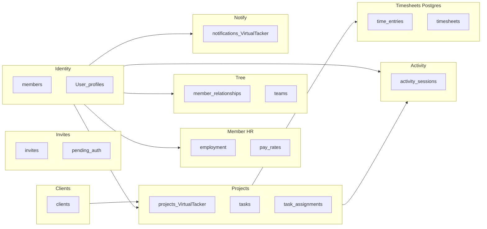
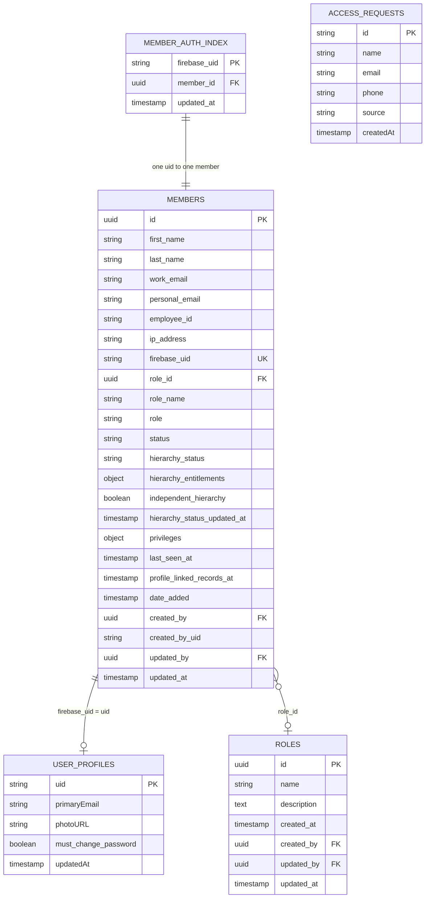
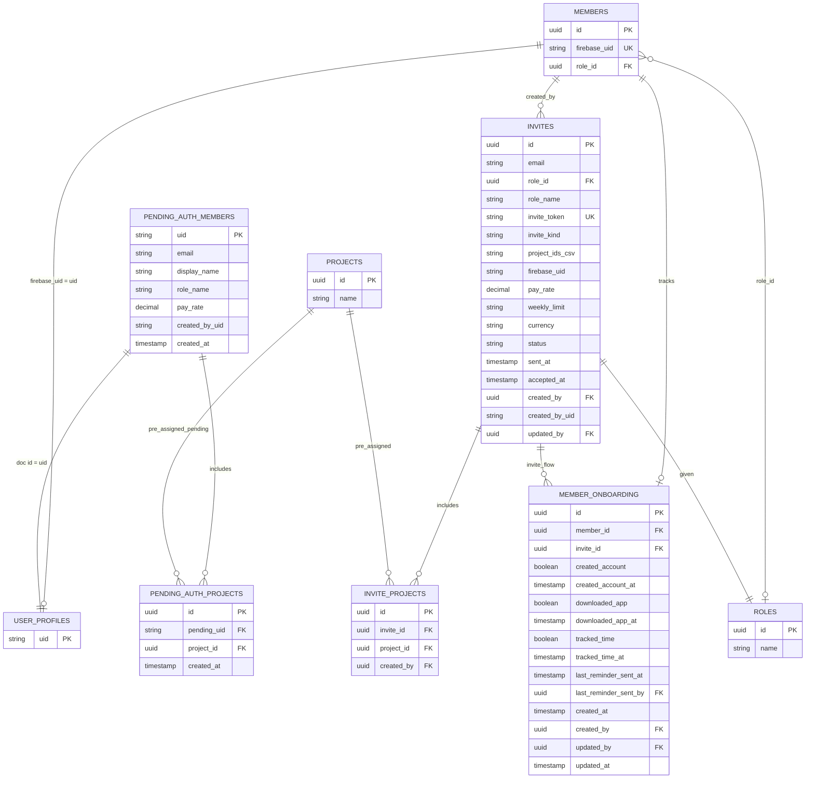
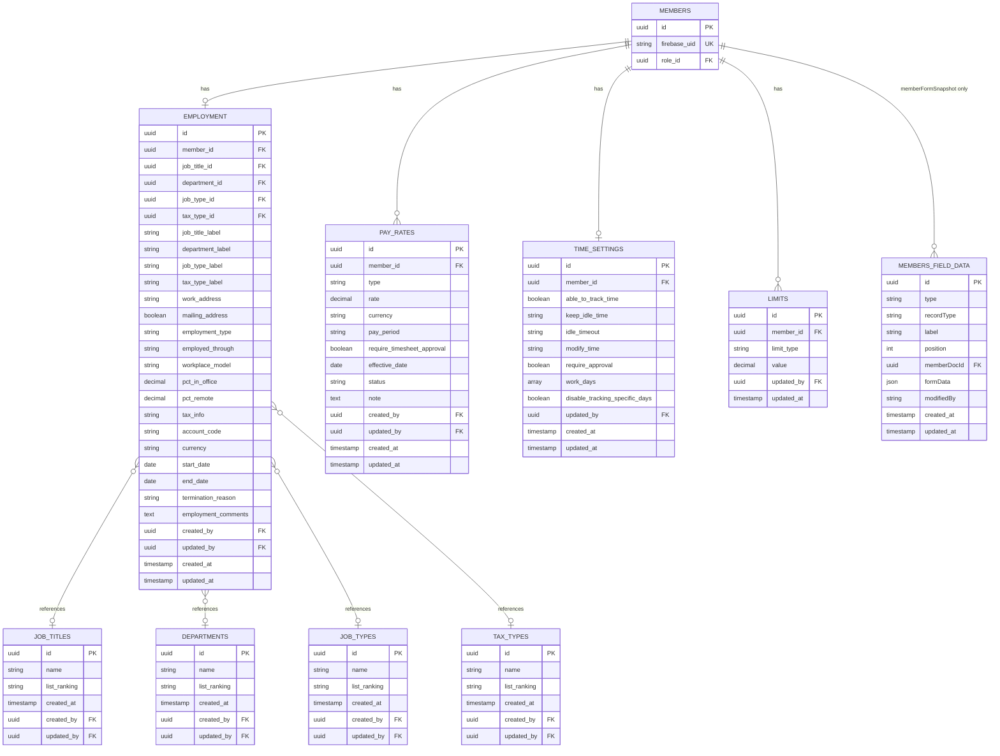
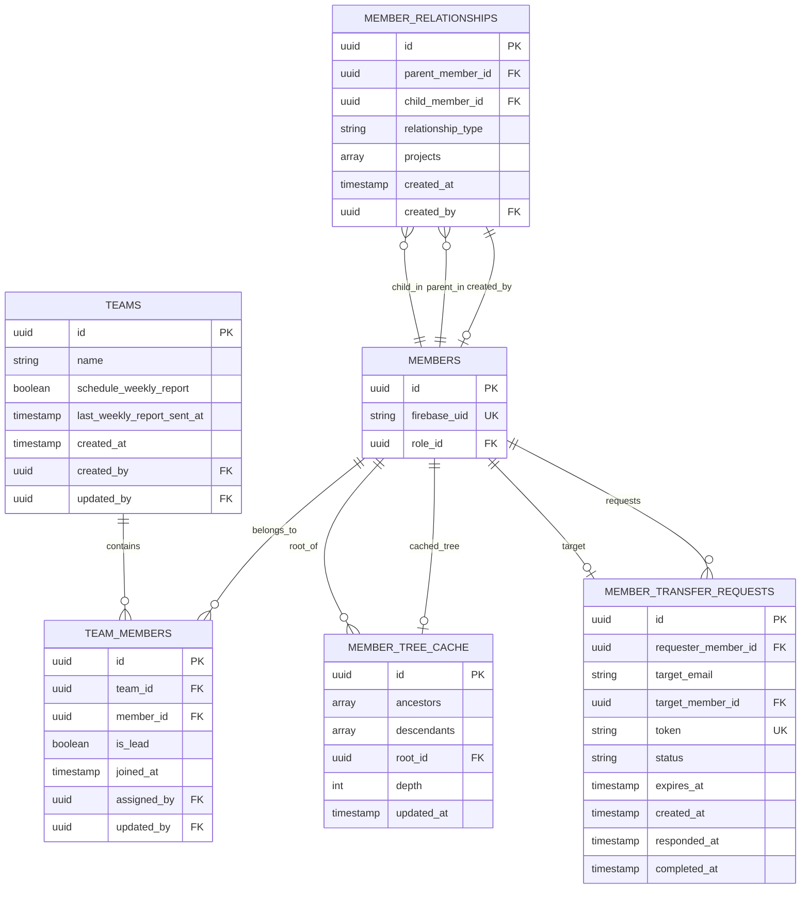
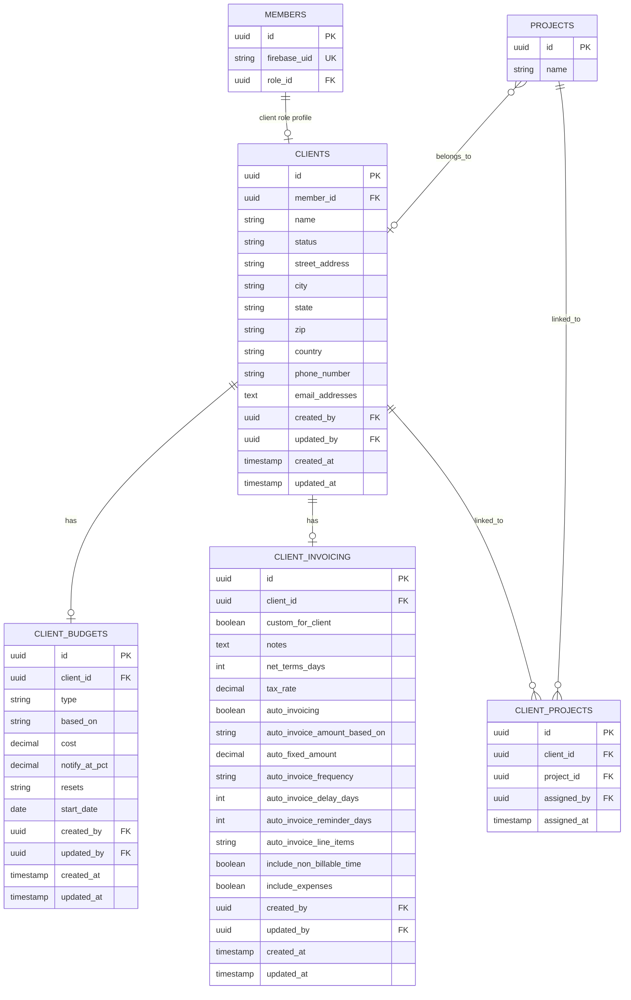
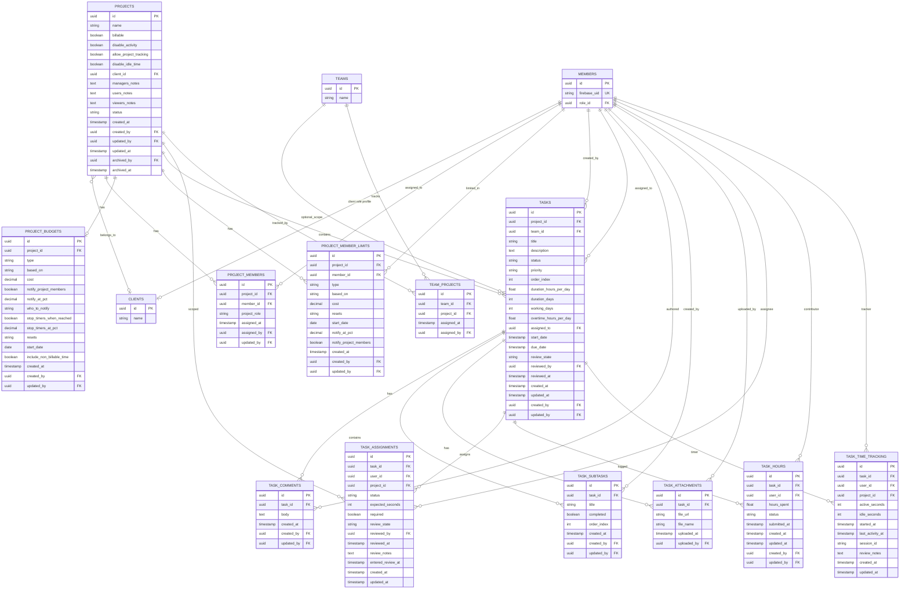
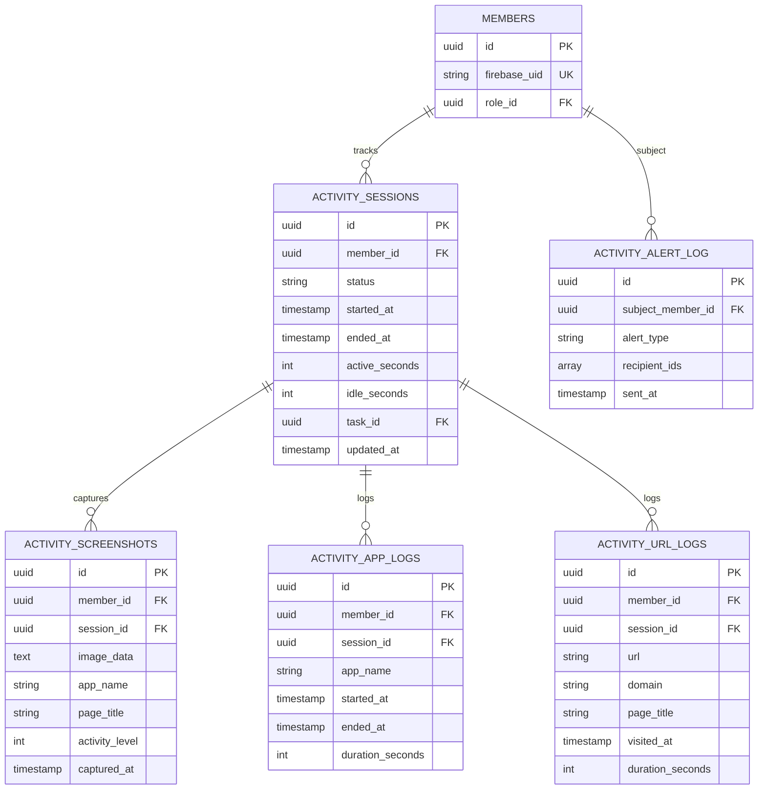
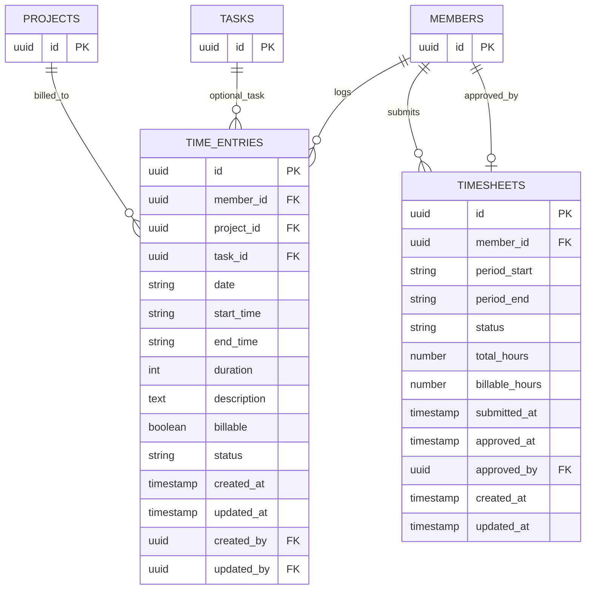
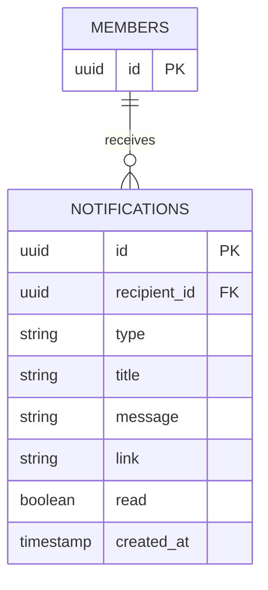

# Virtual Tracker — Entity Relationship Diagram

Hybrid **Firestore + PostgreSQL** backend (`Dashboard-Backend/src`). Member-facing business data stays in Firestore; static reference data and time tracking rows move to Postgres when `POSTGRES_URL` is configured. Canonical field names are **snake_case**; APIs accept **camelCase** aliases where noted in services.

**Source of truth (code):**

| Artifact | Path |
|----------|------|
| Bootstrap registry (Firestore collections + policies) | `Dashboard-Backend/src/bootstrap/entity-bootstrap-manifest.js` |
| Schema CRUD entities | `Dashboard-Backend/src/modules/schema/catalog/` → `schemaEntities` |
| Canonical Firestore collection names | `Dashboard-Backend/src/lib/firestore/collections.js` |
| Org startup seeds | `Dashboard-Backend/src/bootstrap/entity-bootstrap.js` |
| Postgres client + time/lookup DDL | `Dashboard-Backend/src/lib/postgres/` (`client.js`, `ensure-lookup-schema.js`, `schema.sql`) |
| Lookup cache (5‑min TTL) | `Dashboard-Backend/src/lib/postgres/lookup-cache.js` |
| Lookup CRUD + role resolution (Postgres) | `Dashboard-Backend/src/lib/postgres/lookup-postgres.service.js` |
| Postgres routing for schema entities | `Dashboard-Backend/src/modules/schema/services/postgres-crud.service.js` |
| One-time Firestore → Postgres lookup import | `Dashboard-Backend/scripts/migrate-lookups-to-postgres.mjs` |

Dedicated route modules live under `src/modules/*`; shared HTTP helpers under `src/http/`. Paths below are relative to `Dashboard-Backend/`.

---

## PostgreSQL storage (when `POSTGRES_URL` is set)

Ensured on server start via `ensurePostgresLookupSchema()` in `index.js`. Probed at runtime by `isPostgresLookupReady()` (`src/lib/postgres/lookup-availability.js`). On failure, lookup reads/writes **fall back to Firestore** without crashing the API.

| Postgres table | Replaces / mirrors (Firestore) | Entity keys / APIs |
|----------------|-------------------------------|-------------------|
| `roles` | `roles` | `roles`; role resolution in `relation-sync.js` |
| `lookup_tables` (`category`) | `job_titles`, `departments`, `job_types`, `tax_types` | `job-titles`, `departments`, `job-types`, `tax-types` |
| `org_field_options` | static rows in `members_field_data` | `GET/POST /api/organization-field-options` (dropdown types only) |
| `time_entries` | (was schema-only Firestore) | `time-entries` |
| `timesheets` | (was schema-only Firestore) | `timesheets` |

**In-memory cache:** `getLookupData()` loads all roles + lookups + org options in one round trip; `invalidateLookupCache()` runs after admin writes.

**`members_field_data` split (unchanged):**

| `type` | Storage |
|--------|---------|
| `jobTitle`, `department`, `jobType`, `employmentType`, `employedThrough`, `workplaceModel`, `taxType`, `terminationReason` | Postgres `org_field_options` when lookup schema ready |
| `memberFormSnapshot` | Firestore only (`memberDocId` required) |

**Rollback:** Migration and bootstrap leave legacy Firestore lookup collections in place until cutover is verified. They may still appear in the Firebase console even when Postgres is primary.

---

## Backend module map

| Module | Path prefix | Implementation |
|--------|-------------|----------------|
| Auth (identity) | `/api/auth/*` (subset) | `src/modules/auth/identity-routes.js` — `session-bootstrap`, profile, avatar, deactivation, verification emails |
| Auth (credential) | `/api/auth/*` (subset) | **Auth-Backend** — `verify`, `validate-password`, `password-policy`, `firebase-config`, `resolve-sign-in-methods` (`authn-paths.js`) |
| Members (compat) | `/api/members/*` | `src/modules/compat/routes.js` — list/CRUD, profile GET/PATCH, batch delete, SSE, `GET /members/current` |
| Member invites | `/api/members/*`, `/api/public/invites/*` | `src/modules/members/routes/member-invites.routes.js` |
| Member bans | `/api/member-bans/*` | `src/modules/members/routes/member-bans.routes.js` |
| Remove from tree | `/api/members/remove-from-tree`, batch variant | `src/modules/members/routes/member-remove-from-tree.routes.js` |
| Member profile | `/api/members/:id/profile` | `src/modules/members/services/member-profile.service.js` |
| Member onboarding | `/api/member-onboarding/*` | `src/modules/member-onboarding/routes.js` |
| Member relationships | `/api/member-relationships/*` | `src/modules/member-relationships/routes.js`, `service.js` — tree, scoped-members, visibility |
| Hierarchy / transfer | `/api/member-transfer-requests/*`, `/api/public/member-transfer-requests/*` | `src/modules/hierarchy/routes.js`, `transfer-request.service.js` |
| Schema CRUD | `/api/{entity-key}`, `/api/schema/entities` | `src/modules/schema/routes.js` — Firestore or Postgres per `postgres-crud.service.js` |
| Clients | `/api/clients/*` | `src/modules/clients/routes.js`, `services/*` |
| Projects | `/api/projects/*` | `src/modules/projects/routes.js` |
| Tasks | `/api/tasks/*`, task child keys | `src/modules/tasks/routes.js` + schema CRUD |
| Activity | `/api/activity/*` | `src/modules/activity/routes.js`, `activity-alerts.js` |
| Dashboard | `/api/dashboard/*` | `src/modules/dashboard/routes.js` |
| Notifications | `/api/notifications/*` | `src/modules/notifications/routes.js` |
| Presence | `/api/presence/events`, `/api/presence/ws` | `src/modules/presence/` — RTDB `presence/{memberId}` + in-memory fallback |
| Monitor | `/monitor/*` | `src/modules/monitor/routes.js` |
| Compat bridges | `/api/invites`, `/api/member-invites`, `/api/organization-field-options` | `src/modules/compat/routes.js` |
| Org bootstrap | (server start, deferred) | `src/bootstrap/entity-bootstrap.js` ← `scheduleOrganizationMaintenance` in `index.js` |

**Router order** (`src/app/handle-request.js`): auth identity (non-Auth-Backend paths) → **member bans** → **remove-from-tree** → member invites → onboarding → **transfer requests** → relationships → activity → projects → **dashboard** → bootstrap → clients → tasks → notifications → **presence** → compat → schema CRUD.

---

## Entity diagram

> **Firestore** collections are **top-level** (`db.collection(name)`). **Postgres** holds static lookups and time rows when configured (see [PostgreSQL storage](#postgresql-storage-when-postgres_url-is-set)). Cross-domain links use **FK tables** — fetch only the domain you need per screen. Live presence is **not** a Firestore collection (see § Presence).

### Diagram index

| # | Domain | Collections | When to load together |
|---|--------|-------------|------------------------|
| 1 | [Identity & roles](#diagram-1--identity-auth--roles) | 5 Firestore + Postgres `roles` + RTDB | Auth `session-bootstrap`, `GET /members/current`, presence SSE/WS |
| 2 | [Invites](#diagram-2--invites--pre-provision) | 5 + stubs | Invite admin, registration |
| 3 | [Member HR](#diagram-3--member-hr--profile-extensions) | 5 Firestore + Postgres lookups + `memberFormSnapshot` stub | Member profile modal only |
| 4 | [Teams & tree](#diagram-4--teams--member-tree) | 5 + stub | Tree / visibility / transfer routes |
| 5 | [Clients](#diagram-5--clients) | 4 + stubs | Client enriched list / edit |
| 6 | [Projects & tasks](#diagram-6--projects-tasks--team-links) | 12 + stubs | Per-project workspace, assignments, timers |
| 7 | [Activity](#diagram-7--activity-tracking-runtime) | 5 + stub | Tracking session & feed |
| 8 | [Timesheets](#diagram-8--timesheets) | Postgres `time_entries` + `timesheets` (or Firestore fallback) | Timesheet UI, payroll period submit |
| 9 | [Notifications](#diagram-9--notifications) | 1 | In-app notification bell |

### Domain map (read order / bandwidth)

Collections are **not nested under** `members/{id}/…` (see `INVALID_MEMBER_SUBCOLLECTIONS`). Cross-domain links use **FK tables** — fetch only the domain you need per screen.

### Bandwidth guidelines

| Screen / flow | Prefer these collections | Avoid loading at the same time |
|---------------|--------------------------|--------------------------------|
| Login bootstrap | `member_auth_index`, `members`, `roles` (Postgres or Firestore), `User_profiles`, RTDB `presence/{id}` | `activity_*`, full `tasks`, all `members` (500) |
| Members list | `members` (capped), presence via SSE/WS + `last_seen_at`, enrich roles/teams in batch | `activity_screenshots`, per-member `employment` |
| Member manage modal | `members` + profile service tables (§3) | Org-wide `projects_VirtualTacker`, `tasks` |
| Projects / tasks UI | `projects_VirtualTacker`, `project_members`, `tasks` **filtered by project_id** | All members, activity feed |
| Activity feed | `activity_sessions`, `activity_screenshots` / logs **for one member** | `GET /api/members` repeat polling |
| Client edit | `clients`, `client_budgets`, `client_invoicing`, `client_projects` | Unrelated member HR rows |
| Timesheets | `time_entries` and/or `timesheets` **for one member + period** | Org-wide `time_entries` |
| Scoped members tree | `member_relationships`, `member_tree_cache`, `GET /scoped-members` | Full unscoped `members` list |

**List enrichment** (`GET /api/members`): merges live presence (runtime store / RTDB) and denormalized `role` / `role_name` on read — still backed by FK tables in §1–2, not extra subcollections. `last_seen_at` on `members` is written on WebSocket disconnect only.

### Diagram 1 — Identity, auth & roles

Login, profile, role assignment, live presence. Fetch together on `session-bootstrap` — not with project/task lists.

> **`ROLES`:** Stored in **Postgres** `roles` when `isPostgresLookupReady()`; legacy Firestore `roles` collection may still exist for rollback. Resolved via `getLookupData()` / `resolveRoleIdByName` / `resolveRoleNameById` in `relation-sync.js`.
>
> **Primary role assignment:** `members.role_id` only. `syncMemberPrimaryRole` writes `role_id` and strips legacy `role_name`, `role`, and nested role fields from the member document. `alignMemberRoleTables` runs on `session-bootstrap` and profile saves.
>
> **`member_roles` (legacy):** No longer written. Orphan rows may remain from older releases; `GET /api/members` may still query the collection but `pickCanonicalPrimaryRoleName` uses `members.role_id` only.

> **Live presence** is stored in Firebase Realtime Database at `presence/{memberId}` (`status`, `lastSeenAt`, `lastActivityAt`, `connectionCount`). The in-process presence service mirrors RTDB when `FIREBASE_DATABASE_URL` is set; otherwise dev uses an in-memory store. Only `members.last_seen_at` and `profile_linked_records_at` persist in Firestore.

### Diagram 2 — Invites & pre-provision

Invite flows and pending auth. Load only on People › Invites or register — avoid with activity feeds.

### Diagram 3 — Member HR & profile extensions

Manage-modal tabs. Load per `GET /api/members/:id/profile` — not on every members list poll.

> **Employment lookups** (`JOB_TITLES`, `DEPARTMENTS`, `JOB_TYPES`, `TAX_TYPES`): primary store is Postgres `lookup_tables` (by `category`) when lookup schema is ready; legacy Firestore collections mirror the same shape. `employment.*_id` FKs reference UUIDs from whichever store is active.
>
> **`MEMBERS_FIELD_DATA`:** Only **`memberFormSnapshot`** rows remain in Firestore. Org dropdown options (`jobTitle`, `department`, …) live in Postgres `org_field_options` when configured; see [PostgreSQL storage](#postgresql-storage-when-postgres_url-is-set).

### Diagram 4 — Teams & member tree

Org structure and visibility. Tree routes batch relationships + cache — separate from flat members list.

> `hierarchy_status`, `hierarchy_entitlements`, and `independent_hierarchy` on `members` gate suspended / read-only / independent-tree modes. `GET /api/member-relationships/scoped-members` applies role-based visibility (Owner org tree for employees, manageable subtree for managers).

### Diagram 5 — Clients

Client module aggregate (`/api/clients/enriched`). One client + budgets + invoicing + project links per screen.

### Diagram 6 — Projects, tasks & team links

Project workspace. Scope tasks query by `project_id`; do not load all tasks with org-wide members.

> **Note**: `TASKS`, `TASK_ASSIGNMENTS`, and `TASK_TIME_TRACKING` below moved to PostgreSQL (implementation.md Phase 2) - see `SQL-RT-TableNames.md` for the current schema. `TASK_ASSIGNMENTS.user_id` is now `member_id` (Phase 4.4). `TASK_TIME_TRACKING` itself no longer exists as a separate table - it was folded into `task_member_progress`, which also gained a trigger-maintained rollup back onto `TASKS.total_active_seconds`/`total_idle_seconds` (Phase 4.8). The blocks below predate the migration and haven't been redrawn.

> Firestore collection for projects is `projects_VirtualTacker` (see `COLLECTIONS.projects` in `collections.js`). Schema entity key remains `projects`.

### Diagram 7 — Activity tracking (runtime)

High-volume runtime data. Sessions + incremental events — never bundle screenshots into members SSE.

### Diagram 8 — Timesheets

Pay-period submissions and logged time rows. Load per member + date range — not with org-wide members list.

> **Storage:** When `POSTGRES_URL` is set, `TIME_ENTRIES` and `TIMESHEETS` are Postgres tables (schema CRUD via `postgres-crud.service.js`). Without Postgres, schema CRUD falls back to Firestore collections of the same names.

### Diagram 9 — Notifications

In-app notification feed per recipient.

> Firestore collection: `notifications_VirtualTacker` (`COLLECTIONS.notifications`).

> **Firestore collection names** match the diagram entities (snake_case plural). Exceptions: `USER_PROFILES` → `User_profiles`; `PROJECTS` → `projects_VirtualTacker`; `NOTIFICATIONS` → `notifications_VirtualTacker`; `MEMBER_AUTH_INDEX` uses document id = `firebase_uid`.

> **List/API enrichment:** `GET /api/members` merges live presence (`tracking_status`, `lastSeenAt`) from the runtime/RTDB store and may surface `pay_rate`, `weekly_limit`, and `role` / `role_name` derived on read from `pay_rates`, `limits`, and `members.role_id` + `roles` — not persisted denormalized fields on `members`.

> **Role fields on `members`:** `syncMemberPrimaryRole` deletes legacy `role_name`, `role`, and nested role blobs from member documents. List responses re-attach `role` / `role_name` during enrichment.
> **Never nest** `employment`, `limits`, `pay_rates`, `time_settings`, etc. under `members/{id}/…`. See `Dashboard-Backend/src/lib/firestore/collections.js` (`INVALID_MEMBER_SUBCOLLECTIONS`).

---

## Schema catalog entities (CRUD)

Registered in `src/modules/schema/catalog/index.js` as `schemaEntities`. HTTP paths use the **entity key** (kebab-case). **Primary storage** is Postgres when `shouldRouteEntityToPostgres(entityKey)` is true (`postgres-crud.service.js`); otherwise Firestore uses the **collection** column.

| Entity key (API path segment) | Firestore collection | Primary storage (when `POSTGRES_URL` set) |
|------------------------------|----------------------|-------------------------------------------|
| `members` | `members` | Firestore |
| `roles` | `roles` | **Postgres** `roles` |
| `member-roles` | `member_roles` | Firestore (legacy; prefer `members.role_id`) |
| `member-onboarding` | `member_onboarding` | Firestore |
| `invites` | `invites` | Firestore |
| `invite-projects` | `invite_projects` | Firestore |
| `job-titles` | `job_titles` | **Postgres** `lookup_tables` (`category = job_title`) |
| `departments` | `departments` | **Postgres** `lookup_tables` (`category = department`) |
| `job-types` | `job_types` | **Postgres** `lookup_tables` (`category = job_type`) |
| `tax-types` | `tax_types` | **Postgres** `lookup_tables` (`category = tax_type`) |
| `employment` | `employment` | Firestore |
| `pay-rates` | `pay_rates` | Firestore |
| `time-settings` | `time_settings` | Firestore |
| `limits` | `limits` | Firestore |
| `clients` | `clients` | Firestore |
| `client-budgets` | `client_budgets` | Firestore |
| `client-invoicing` | `client_invoicing` | Firestore |
| `client-projects` | `client_projects` | Firestore |
| `projects` | `projects_VirtualTacker` | Firestore |
| `project-members` | `project_members` | Firestore |
| `project-budgets` | `project_budgets` | Firestore |
| `project-member-limits` | `project_member_limits` | Firestore |
| `tasks` | — | **Postgres** `tasks` (implementation.md Phase 2; no Firestore fallback) |
| `task-subtasks` | `task_subtasks` | Firestore |
| `task-comments` | `task_comments` | Firestore |
| `task-attachments` | `task_attachments` | Firestore |
| `task-assignments` | — | **Postgres** `task_assignments` (Phase 2; no Firestore fallback) |
| `task-hours` | `task_hours` | Firestore |
| ~~`task-time-tracking`~~ | — | **Removed from the generic catalog entirely** (legacy cleanup) - real store is Postgres `task_member_progress`, addressed by `(task_id, member_id)` not a generic `id`, so it's served only by the dedicated `/api/tasks/:id/time-tracking` route, not `/api/{key}` |
| `teams` | `teams` | Firestore |
| `team-members` | `team_members` | Firestore |
| `team-projects` | `team_projects` | Firestore |
| `member-relationships` | `member_relationships` | Firestore |
| `member-tree-cache` | `member_tree_cache` | Firestore |
| `member-transfer-requests` | `member_transfer_requests` | Firestore |
| `time-entries` | `time_entries` | **Postgres** `time_entries` |
| `timesheets` | `timesheets` | **Postgres** `timesheets` |
| `notifications` | `notifications` | **Postgres** `notifications` |

`GET /api/schema/entities` returns the catalog metadata. Generic CRUD: `GET/POST /api/{key}`, `GET/PATCH/DELETE /api/{key}/:id`.

The whole activity domain (`activity_sessions`, `activity_screenshots`, `activity_app_logs`, `activity_url_logs`, `activity_alert_log`) was removed from this generic-CRUD catalog entirely and moved to **Postgres** — none of them are reachable via `/api/{key}` anymore, only through the dedicated `/api/activity/*` routes. See SQL-RT-TableNames.md.

`tasks` and `task_assignments` also moved to Postgres (implementation.md Phase 2) but stayed in the generic catalog, routed by `shouldRouteEntityToPostgres()` same as `time-entries`/`timesheets`. `task-time-tracking` was removed from the catalog entirely rather than wired to Postgres - the real store (`task_member_progress`) is addressed by `(task_id, member_id)`, not a generic `id`, and the only real client already uses the dedicated `/api/tasks/:id/time-tracking` route; the generic path had no caller and would have written into an orphaned Firestore collection if ever hit.

**Dedicated routes (not only schema CRUD):**

| Route | Notes |
|-------|--------|
| `PATCH /api/tasks/batch/reorder` | Bulk `order_index` updates (`schema/routes.js`) |
| `/api/clients/*`, `/api/projects/*`, `/api/members/:id/profile` | See module map above |

**Collections managed outside schema catalog** (services / auth flows):

| Collection | Handled by |
|------------|------------|
| `User_profiles` | `identity-routes.js`, `profile-sync.js`, `session-bootstrap.js` |
| `member_auth_index` | `members/services/member-dedupe.js`, `ensure-member-from-auth.js` |
| `pending_auth_members`, `pending_auth_projects` | `members/routes/member-invites.routes.js` |
| `access_requests` | `identity-routes.js` |
| `deactivation_requests` | `auth/account-deactivation.js` |
| `members_field_data` | Org `memberFormSnapshot` in Firestore; static dropdown types in Postgres `org_field_options` when ready (`compat/routes.js`) |
| `system_meta` | Bootstrap markers (`entity_bootstrap`, legacy id migration) |
| `member_tree` | Legacy only (`member-relationships/migrate.js`) |
| RTDB `presence/{memberId}` | `modules/presence/` — not Firestore |

**Cascade deletes (`schema/routes.js`):**

- Delete **team** → `team_members`, `team_projects`, then team.
- Delete **client** → `client_budgets`, `client_invoicing`, `client_projects`, then client.

---

## FK tables as source of truth

Assignment and role data must not be duplicated on `members` documents. List views enrich on read; writes go through `relation-sync.js` and profile services.

| Concern | Source-of-truth table | Enriched on list as |
|---------|----------------------|---------------------|
| Primary role | `members.role_id` + `roles` (Postgres or Firestore) | `role` / `role_name` |
| Teams | `team_members` + `teams.name` | `teams[]` |
| Projects | `project_members` | project count / ids |
| Invite projects | `invite_projects` | invite `project_count` (FK preferred over CSV) |
| Pre-provision projects | `pending_auth_projects` → promoted to `project_members` | pending invite rows |
| Client ↔ project | `client_projects` | client `projects[]` on enriched client |
| Project roles | `project_members.project_role` | `manager` / `user` / `viewer` / `member` |

**Default roles** (`roles.name`, seeded by `ensureDefaultRoles` in `relation-sync.js` → Postgres or Firestore): Owner, Super Admin, Admin, Super Manager, Manager, Employee L2, Employee L1, Employee L0, Client, Viewer.

**Project roles** (`project_members.project_role`): `manager`, `user`, `viewer`, `member`.

---

## Member lifecycle & auth

| Stage | Collection | Becomes on sign-in |
|-------|------------|-------------------|
| Admin pre-provisions | `pending_auth_members` (doc id = Firebase UID) | `members` + `project_members` |
| Pre-assigned projects | `pending_auth_projects` | via `syncProjectMembersForMember` |
| Email invite (token) | `invites` + `invite_projects` | `members` + `project_members` on register |
| Open invite link | `invites` (`invite_kind=open_link`) | `members` on register |
| First sign-in (no row) | — | `ensureMemberFromAuth` creates `members` |
| Auth profile | `User_profiles` | linked by `members.firebase_uid` |
| Session bootstrap | — | `POST /api/auth/session-bootstrap` → `ensureMemberLinkedRecordsForUserRecord` (full diagram policy) |
| Server startup bootstrap | — | `scheduleOrganizationMaintenance` → `ensureOrganizationEntities` (deferred off critical path) |

**Bootstrap registry** — mirrors `ENTITY_BOOTSTRAP_MANIFEST` in `src/bootstrap/entity-bootstrap-manifest.js`:

| Firestore collection | Policy | Notes |
|----------------------|--------|--------|
| `User_profiles` | `auth_flow` | Upsert on `session-bootstrap` |
| `members` | `auth_flow` | `ensureMemberRowForUserRecord` on bootstrap |
| `pending_auth_members` | `auth_flow` | Admin pre-provision |
| `pending_auth_projects` | `auth_flow` | With pending auth member |
| `access_requests` | `on_demand` | Public access-request form |
| `roles` | `org_seed` | Default Owner → Viewer (10 roles); **Postgres** when lookup schema ready |
| `member_auth_index` | `auth_flow` | `firebase_uid` → `members.id` |
| `member_onboarding` | `member_ensure` | |
| `invites` | `on_demand` | |
| `invite_projects` | `on_demand` | |
| `members_field_data` | `org_seed` | `memberFormSnapshot` in Firestore; org dropdown seeds → Postgres `org_field_options` when ready |
| `job_titles` | `org_seed` | **Postgres** `lookup_tables` when ready; Firestore fallback |
| `departments` | `org_seed` | same |
| `job_types` | `org_seed` | same |
| `tax_types` | `org_seed` | same |
| `employment` | `member_ensure` | |
| `pay_rates` | `member_ensure` | |
| `time_settings` | `member_ensure` | |
| `limits` | `member_ensure` | weekly + daily rows |
| `member_relationships` | `org_seed` | `initializeMemberRelationships` when empty |
| `member_tree_cache` | `member_ensure` | |
| `member_tree` | `on_demand` | Legacy; migration only |
| `clients` | `on_demand` | |
| `client_budgets` | `on_demand` | |
| `client_invoicing` | `on_demand` | |
| `client_projects` | `on_demand` | |
| `projects_VirtualTacker` | `on_demand` | Schema key `projects` |
| `project_members` | `on_demand` | |
| `project_budgets` | `on_demand` | |
| `project_member_limits` | `on_demand` | |
| `teams` | `on_demand` | |
| `team_members` | `on_demand` | |
| `team_projects` | `on_demand` | |
| ~~`tasks`~~ | `on_demand` | **Moved to Postgres** (Phase 2) - row inert, kept for history |
| `task_subtasks` | `on_demand` | |
| `task_comments` | `on_demand` | |
| `task_attachments` | `on_demand` | |
| ~~`task_assignments`~~ | `on_demand` | **Moved to Postgres** (Phase 2) - row inert, kept for history |
| `task_hours` | `on_demand` | Submitted hours per task |
| ~~`task_time_tracking`~~ | `runtime` | **Moved to Postgres** `task_member_progress` (Phase 2) - row inert, kept for history |
| `activity_sessions` | `runtime` | |
| `activity_screenshots` | `runtime` | Ingest disabled unless env flags set |
| `activity_app_logs` | `runtime` | |
| `activity_url_logs` | `runtime` | |
| `system_meta` | `org_marker` | `entity_bootstrap` + id migration markers |

**Schema catalog only** (not in `ENTITY_BOOTSTRAP_MANIFEST`; created on first API write):

| Firestore collection | Entity key | Notes |
|----------------------|------------|--------|
| `time_entries` | `time-entries` | **Postgres** when configured |
| `timesheets` | `timesheets` | **Postgres** when configured |
| `notifications` (table) | `notifications` | **Postgres** — in-app notifications |
| `member_transfer_requests` | `member-transfer-requests` | Hierarchy transfer workflow |
| `activity_alert_log` | `activity-alert-log` | Activity alert dedupe log |
| `deactivation_requests` | — | Account deactivation approval queue |

**Policy meanings**

| Policy | When data appears |
|--------|-------------------|
| `org_seed` | Server startup (`ensureOrganizationEntities` in `index.js`) if collection empty |
| `org_marker` | Bootstrap metadata only |
| `member_ensure` | `session-bootstrap` / `ensureMemberLinkedRecordsForUserRecord` per member |
| `auth_flow` | Verify / invite / pre-provision flows |
| `on_demand` | UI or API only (e.g. clients, projects, tasks, invites) |
| `runtime` | Activity tracking while app runs |

**Server startup** (`index.js`): `ensurePostgresLookupSchema()` then `scheduleOrganizationMaintenance` → seeds roles/lookups/org options (Postgres first, Firestore fallback), `member_relationships` (if empty), writes `system_meta/entity_bootstrap`.

**Session bootstrap** (`POST /api/auth/session-bootstrap` in `session-bootstrap.js`): org bootstrap marker + `members` row + `member_auth_index` + dedupe + `members.profile_linked_records_at` (only after linked records succeed) + `ensureMemberScopedEntities` (`employment`, `pay_rates`, `time_settings`, `limits`, `member_onboarding`, `member_tree_cache`) + `alignMemberRoleTables`.

**Credential verify** (`POST /api/auth/verify`) is handled by **Auth-Backend**, not this service.

**Presence:** WebSocket `/api/presence/ws` and SSE `/api/presence/events` read/write the in-process presence service, which syncs to RTDB `presence/{memberId}` when configured. On disconnect, `members.last_seen_at` is persisted. Management override `PATCH` presence updates runtime only (no Firestore write). Legacy nested `members.presence` object is read for migration only (`presence-status.js`).

**One Firebase user → one member:** canonical map is `member_auth_index/{firebase_uid}` → `members.id` (bootstrap runs `dedupeMembersForFirebaseUid`). `members.firebase_uid` is still written for queries and legacy compat.

**Lookup migration (one-time):** `node --use-system-ca scripts/migrate-lookups-to-postgres.mjs` copies Firestore reference data into Postgres; does not delete Firestore sources.

---

## Member profile API

| Method | Route | Purpose |
|--------|-------|---------|
| GET | `/api/members/:id/profile` | Load manage-modal form + enriched member |
| PATCH/PUT | `/api/members/:id/profile` | Save all manage-modal tabs; upserts `memberFormSnapshot` |
| DELETE | `/api/members/:id` | Cascade profile rows + delete member |

Service: `src/modules/members/services/member-profile.service.js`

**Delete cascade** (`deleteMemberProfileData` + `cascadeDeleteMemberRelations`):

`employment`, `pay_rates`, `time_settings`, `limits`, `team_members`, `project_members`, `member_onboarding`, `members_field_data` (`memberFormSnapshot` only), then `members` document.

---

## Member manage modal → entity fields

| Modal tab | Form field | Entity table.column | Notes |
|-----------|------------|---------------------|-------|
| Info | First / last name | `members.first_name`, `last_name` | List `name` derived |
| Info | Work / personal email | `members.work_email`, `personal_email` | |
| Info | Employee ID, IP | `members.employee_id`, `ip_address` | IP from client on save |
| Employment | Job title, department, job type, tax type | `employment.*_id` + `*_label` | Resolves/creates lookup row in Postgres or Firestore |
| Employment | Address, type, dates, comments | `employment.*` | Direct columns |
| Roles | Role | `members.role_id` | `syncMemberPrimaryRole` / `alignMemberRoleTables` |
| Pay & bill | Pay rate, pay period, approval | `pay_rates.*` + `members.pay_rate` | Hourly mirrored on member |
| Work limits | Weekly / daily limit | `limits` + `members.weekly_limit` | `limit_type` = weekly \| daily |
| Work limits | Work days, disable specific days | `time_settings.work_days`, `disable_tracking_specific_days` | Weekday indices 0–6 |
| Settings | Track / idle / manual / approval | `time_settings.*`; live tracking status → runtime presence store | |
| (backup) | Full form JSON | `members_field_data` (`type=memberFormSnapshot`) | Per `memberDocId` |

---

## Clients module API

| Method | Route | Purpose |
|--------|-------|---------|
| GET | `/api/clients/enriched` | List clients + budget + invoicing + project ids |
| GET | `/api/clients/form-config` | Add/edit modal field layout + options |
| GET | `/api/clients/:id/edit-state` | Load client for edit modal |
| GET | `/api/clients/:id/invoicing` | Resolved invoicing (global vs custom) |
| POST | `/api/clients/with-details` | Create client + budget + invoicing + `client_projects` |
| PUT | `/api/clients/:id/with-details` | Update client aggregate |

Service: `src/modules/clients/services/client-service.js`, `budget-logic.js`, `invoicing-logic.js`

### Add / edit client modal → entity fields

| Modal tab | Form field | Entity table.column |
|-----------|------------|---------------------|
| General | Client member | `clients.member_id` |
| General | Name | `clients.name` |
| General | Address | `clients.street_address`, `city`, `state`, `zip`, `country` |
| Contact | Phone, email | `clients.phone_number`, `email_addresses` |
| Projects | Project list | `client_projects.project_id` |
| Budget | Type, based on, cost, notify %, resets, start | `client_budgets.*` |
| Invoicing | Custom, notes, terms, tax, auto rules | `client_invoicing.*` |
| (list) | Active / archived | `clients.status` |

---

## Projects module API

| Method | Route | Purpose |
|--------|-------|---------|
| GET | `/api/projects/form-config` | Add/edit modal tabs, fields, client/member options |
| GET | `/api/projects/:id/edit-state` | Load project for edit (members by role, budget, limits) |
| GET | `/api/projects/:id/teams` | Teams linked via `team_projects` |
| GET | `/api/projects/team-links` | All `team_projects` with team names |
| GET/POST/PATCH/DELETE | `/api/projects` (schema key) | Core project CRUD via schema catalog |
| PATCH | `/api/tasks/batch/reorder` | Reorder task `order_index` (schema routes) |
| — | Frontend `createProjectWithDetails` | Creates `projects`, `project_members`, `project_budgets`, `project_member_limits`, `team_projects` via schema + detail helpers |

### Add / edit project modal → entity fields

| Modal tab | Form field | Entity table.column |
|-----------|------------|---------------------|
| General | Project name(s) | `projects.name` |
| General | Billable, activity, tracking, idle | `projects.billable`, `disable_activity`, `allow_project_tracking`, `disable_idle_time` |
| General | Client | `projects.client_id` |
| Members | Managers, users, viewers, members | `project_members` (`project_role`) |
| Teams | Team list | `team_projects.team_id` |
| Budget | Type, based on, cost, notify, resets, dates | `project_budgets.*` |
| Budget | Member limits | `project_member_limits.*` + member multiselect |

**Task ↔ team rule:** When `tasks.team_id` is set, that team must already be linked to the same `tasks.project_id` via `team_projects` (enforced in `schema-crud.service.js` on create/update).

---

## Tasks module API

| Method | Route | Purpose |
|--------|-------|---------|
| GET/POST/PATCH/DELETE | `/api/tasks` (schema key) | Task CRUD via schema catalog |
| PATCH | `/api/tasks/batch/reorder` | Bulk `order_index` updates |
| GET | `/api/projects/:id/teams` | Teams linked to project via `team_projects` (used by task forms) |
| GET/POST/PATCH/DELETE | `/api/task-subtasks`, `/api/task-comments`, `/api/task-attachments`, `/api/task-hours` | Task child entities (still Firestore) |
| GET/POST/PATCH/DELETE | `/api/task-assignments` | Assignments - generic catalog, routed to Postgres |
| GET | `/api/tasks/:id/time-tracking`, `/api/tasks/:id/progress`, `/api/tasks/:id/progress/me` | Active timer state - dedicated routes only, not generic catalog (see schema catalog entities section above) |

### Add / edit task modal → entity fields

| Form field | Entity table.column | Notes |
|------------|---------------------|-------|
| Name | `tasks.title` | Required |
| Description | `tasks.description` | |
| Team | `tasks.team_id` | Must exist in `team_projects` for `project_id` |
| Duration | `tasks.duration_hours_per_day`, `duration_days`, `working_days`, `overtime_hours_per_day` | Scheduling fields |
| List / status | `tasks.status` | `todo`, `in_progress`, `in_review`, `blocked`, `done` |
| Priority | `tasks.priority` | `low`, `medium`, `high`, `urgent` |
| Assignee | `tasks.assigned_to` | Member on selected team; multi-assign via `task_assignments` |
| Review | `tasks.review_state`, `reviewed_by`, `reviewed_at` | Task-level review |
| Start date | `tasks.start_date` | Optional ISO date |
| Due date | `tasks.due_date` | Optional ISO date |
| Position (create) | `tasks.order_index` | Top vs bottom of list |

---

## Activity tracking

| Collection | Purpose |
|------------|---------|
| `activity_sessions` | Timer session (`active` / `idle` / `stopped`), seconds tallies, optional `task_id` |
| `activity_screenshots` | Thumbnails (`image_data`, `app_name`, `page_title`, `activity_level`) |
| `activity_app_logs` | App usage segments per session |
| `activity_url_logs` | URL visits per session |
| `activity_alert_log` | Deduped alert sends (`subject_member_id`, `alert_type`, `recipient_ids`) |

| Method | Route | Purpose |
|--------|-------|---------|
| GET | `/api/activity/session` | Current/open session for member |
| POST | `/api/activity/session` | Start/stop/idle session; updates runtime presence |
| POST | `/api/activity/events` | Batch screenshots, app logs, URL logs |
| GET | `/api/activity/feed` | Activity feed (screenshots, apps, URLs) |
| POST | `/api/activity/agent/register` | Desktop agent registration |

---

## Timesheets

| Method | Route | Purpose |
|--------|-------|---------|
| GET/POST/PATCH/DELETE | `/api/time-entries` | Logged time rows (schema CRUD → Postgres when configured) |
| GET/POST/PATCH/DELETE | `/api/timesheets` | Pay-period submissions (schema CRUD → Postgres when configured) |

Visibility rules in `schema/visibility.js` scope time entries and timesheets by member hierarchy.

---

## Notifications

| Method | Route | Purpose |
|--------|-------|---------|
| GET | `/api/notifications` | List notifications for current member |
| POST | `/api/notifications/:id/read` | Mark one read |
| POST | `/api/notifications/read-all` | Mark all read |
| DELETE | `/api/notifications/:id` | Delete notification |

Collection: `notifications_VirtualTacker`. Created by task assignment flows, activity alerts, and other modules.

---

## Member hierarchy transfer

| Method | Route | Purpose |
|--------|-------|---------|
| POST | `/api/member-transfer-requests` | Owner / Super Admin / Admin creates transfer request |
| GET | `/api/public/member-transfer-requests/:token` | Preview (no auth) |
| POST | `/api/public/member-transfer-requests/:token/accept` | Target accepts (auth required) |
| POST | `/api/public/member-transfer-requests/:token/decline` | Target declines (auth required) |

Collection: `member_transfer_requests`. On completion, `member_relationships` parent is updated.

---

## Presence (live status)

| Store | Path | Fields |
|-------|------|--------|
| RTDB (production) | `presence/{memberId}` | `status`, `lastSeenAt`, `lastActivityAt`, `connectionCount`, `updatedAt` |
| Firestore (persisted) | `members.last_seen_at` | Written on WebSocket disconnect |
| In-process | `modules/presence/` | Source of truth for API enrichment when WS connected |

| Method | Route | Purpose |
|--------|-------|---------|
| GET | `/api/presence/events` | SSE stream of presence changes |
| WS | `/api/presence/ws` | Client heartbeat + live status |

---

## Organization field options

`GET/POST /api/organization-field-options` — static dropdown types are served from **Postgres** `org_field_options` when `isPostgresLookupReady()`; otherwise Firestore `members_field_data`.

| type | Purpose | Storage |
|------|---------|---------|
| `jobTitle`, `department`, `jobType`, `employmentType`, `employedThrough`, `workplaceModel`, `taxType`, `terminationReason` | Employment dropdown options | Postgres `org_field_options` (primary) |
| `memberFormSnapshot` | Per-member manage-modal JSON backup (`memberDocId` required) | Firestore `members_field_data` only |

---

## Member relationships tree

| Collection | Purpose |
|------------|---------|
| `member_relationships` | `parent_member_id` added `child_member_id`; `relationship_type`: invite, preprovision, self_signup, admin_create; optional `projects[]` for visibility |
| `member_tree_cache` | Denormalized ancestors/descendants for fast reads |

Key routes under `/api/member-relationships/*`: visual-tree, ancestors, descendants, tree-path, shared-projects, visible, check-ancestor, initialize, reinitialize, **scoped-members**, **team-staffable-members**, **audit**, **repair-orphans**, **repair-status**.

---

## Invites & compat (legacy bridges)

| Route | Purpose |
|-------|---------|
| `GET/POST/PATCH/DELETE /api/invites` | Invite CRUD (compat) |
| `POST /api/invites/bulk` | Bulk invite create |
| `GET /api/members` (enriched) | Members list with roles, teams, project counts |
| `GET /api/members/events` | SSE member list stream |
| `POST /api/members/batch-delete` | Batch delete with relation cascade |
| `GET /api/members/current` | Resolve member from Firebase token |
| `GET/POST /api/member-bans` | List / create member or device bans |
| `POST /api/member-bans/:id/revoke` | Revoke a ban |
| `POST /api/members/remove-from-tree` | Remove one member from hierarchy tree |
| `POST /api/members/batch-remove-from-tree` | Batch remove from tree |

Invite implementation: `src/modules/members/routes/member-invites.routes.js` (register, redeem, pre-provision, open-link).

---

## Indexes & conventions

- Primary keys: UUID v4 (`generateUUID()` in catalog), except `pending_auth_members` and `User_profiles` use Firebase UID as document id. Postgres tables use UUID PKs (`gen_random_uuid()` default on insert).
- Timestamps: Firestore `Timestamp` in collections; `TIMESTAMPTZ` in Postgres tables.
- API inputs: services accept snake_case and camelCase (e.g. `client_id` / `clientId`).
- Archived: `projects.status = archived`, `clients.status = archived`; list endpoints filter active by default where applicable.
