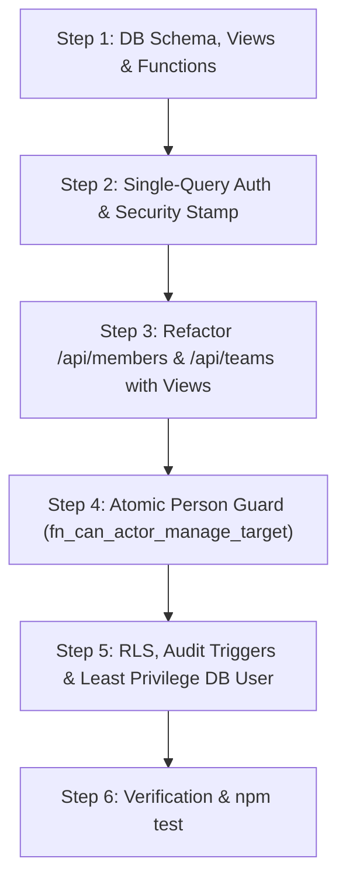

# Master Execution Plan: SQL Relations, Roles & Authorization Architecture Migration

## Executive Summary

The Virtual Tracker platform has successfully migrated core domain data—including members, teams, projects, tasks, clients, time entries, and invites—from Google Firestore into **PostgreSQL**. 

However, because this transition was executed as a rapid "smallest possible diff" migration, much of the backend logic in `Dashboard-Backend` still operates under **legacy NoSQL patterns**:
1. **In-Memory Application Joins**: Endpoints (such as `GET /api/members` and `GET /api/teams`) perform multiple separate SQL queries and manually join tables in Node.js memory using JavaScript `Map` objects.
2. **Procedural Auth Scoping**: Authorization and visibility checks (e.g., manager subtree access, role permissions) are re-evaluated procedurally across individual route files instead of using a unified policy engine or database-level scoping.
3. **Flawed Person-by-Person Role Verification**: Verifying a person's role requires multiple roundtrips and translations (`member.role_id` -> DB `roles` table lookup -> `roleName` string -> string normalization -> string array `.includes()` check), backed by a 15-second in-memory TTL cache (`role-cache.js`). This creates stale role authorization windows, silent fallbacks to `"Viewer"`, and fragile string-matching bugs (e.g. legacy typos like `"supermanger"`).

This document serves as the **actionable master execution plan** detailing the exact steps, SQL DDL statements, code refactoring blueprints, and verification tests required to transform the architecture.

---

## Step 1: Database Schema, Enriched Views & PL/pgSQL Functions

### 1.1 Add Hierarchy & Security Columns to Database Tables
Modify `ensure-lookup-schema.js` and `schema.sql` to execute the following DDL statements on server boot:

```sql
-- 1. Upgrade roles table with explicit hierarchy level and management flags
ALTER TABLE roles 
  ADD COLUMN IF NOT EXISTS hierarchy_level INTEGER NOT NULL DEFAULT 10,
  ADD COLUMN IF NOT EXISTS is_management BOOLEAN NOT NULL DEFAULT false;

-- Seed default hierarchy levels & management status
UPDATE roles SET hierarchy_level = 100, is_management = true WHERE LOWER(name) IN ('superadmin', 'owner');
UPDATE roles SET hierarchy_level = 80,  is_management = true WHERE LOWER(name) = 'admin';
UPDATE roles SET hierarchy_level = 50,  is_management = true WHERE LOWER(name) IN ('supermanager', 'manager');
UPDATE roles SET hierarchy_level = 20,  is_management = false WHERE LOWER(name) IN ('employee', 'user');
UPDATE roles SET hierarchy_level = 10,  is_management = false WHERE LOWER(name) = 'client';

-- 2. Add security_stamp to members for instant session revocation
ALTER TABLE members 
  ADD COLUMN IF NOT EXISTS security_stamp UUID DEFAULT gen_random_uuid();

-- 3. Create role_permissions table
CREATE TABLE IF NOT EXISTS role_permissions (
  id              UUID PRIMARY KEY DEFAULT gen_random_uuid(),
  role_id         UUID NOT NULL REFERENCES roles(id) ON DELETE CASCADE,
  permission_key  VARCHAR(100) NOT NULL,
  created_at      TIMESTAMPTZ NOT NULL DEFAULT now(),
  UNIQUE (role_id, permission_key)
);
CREATE INDEX IF NOT EXISTS idx_role_perms_role ON role_permissions(role_id);
```

### 1.2 Create Enriched SQL Views
Create database views to handle single-query JSON aggregations:

```sql
-- View: v_members_enriched
CREATE OR REPLACE VIEW v_members_enriched AS
SELECT 
  m.id,
  m.firebase_uid,
  m.first_name,
  m.last_name,
  m.display_name,
  m.work_email,
  m.personal_email,
  m.status,
  m.avatar_url,
  m.avatar_color,
  m.date_added,
  m.role_id,
  r.name AS role_name,
  r.hierarchy_level,
  r.is_management,
  COALESCE(p.rate, 0) AS pay_rate,
  COALESCE(p.pay_period, 'None') AS pay_period,
  l.weekly AS weekly_limit,
  l.daily AS daily_limit,
  
  -- Aggregate Teams as JSON
  COALESCE((
    SELECT json_agg(json_build_object('id', t.id, 'name', t.name, 'is_lead', tm.is_lead))
    FROM team_members tm
    JOIN teams t ON t.id = tm.team_id
    WHERE tm.member_id = m.id
  ), '[]'::json) AS teams,

  -- Aggregate Projects as JSON
  COALESCE((
    SELECT json_agg(json_build_object('id', pr.id, 'name', pr.name))
    FROM project_members pm
    JOIN projects pr ON pr.id = pm.project_id
    WHERE pm.member_id = m.id
  ), '[]'::json) AS projects

FROM members m
LEFT JOIN roles r ON r.id = m.role_id
LEFT JOIN pay_rates p ON p.member_id = m.id
LEFT JOIN limits l ON l.member_id = m.id;
```

### 1.3 Add Recursive CTE & Authorization Functions
Add stored functions for org tree hierarchy and person-to-person role checks:

```sql
-- Subordinate tree CTE function
CREATE OR REPLACE FUNCTION fn_get_subordinate_member_ids(viewer_id UUID)
RETURNS TABLE (member_id UUID, depth INT) AS $$
WITH RECURSIVE org_tree AS (
  SELECT child_member_id AS member_id, 1 AS depth
  FROM member_relationships
  WHERE parent_member_id = viewer_id

  UNION ALL

  SELECT mr.child_member_id, ot.depth + 1
  FROM member_relationships mr
  INNER JOIN org_tree ot ON mr.parent_member_id = ot.member_id
)
SELECT DISTINCT member_id, depth FROM org_tree;
$$ LANGUAGE sql STABLE;

-- Atomic Person-to-Person Role Guard function
CREATE OR REPLACE FUNCTION fn_can_actor_manage_target(actor_id UUID, target_id UUID)
RETURNS BOOLEAN AS $$
DECLARE
  v_actor_level INT;
  v_actor_is_mgmt BOOLEAN;
  v_target_level INT;
  v_is_subordinate BOOLEAN;
BEGIN
  IF actor_id = target_id THEN RETURN TRUE; END IF;

  SELECT r.hierarchy_level, r.is_management 
  INTO v_actor_level, v_actor_is_mgmt
  FROM members m JOIN roles r ON r.id = m.role_id WHERE m.id = actor_id;

  IF COALESCE(v_actor_level, 0) >= 80 THEN RETURN TRUE; END IF;
  IF NOT COALESCE(v_actor_is_mgmt, false) THEN RETURN FALSE; END IF;

  SELECT r.hierarchy_level INTO v_target_level 
  FROM members m JOIN roles r ON r.id = m.role_id WHERE m.id = target_id;

  IF COALESCE(v_actor_level, 0) <= COALESCE(v_target_level, 0) THEN RETURN FALSE; END IF;

  SELECT EXISTS (
    SELECT 1 FROM fn_get_subordinate_member_ids(actor_id) WHERE member_id = target_id
  ) INTO v_is_subordinate;

  RETURN v_is_subordinate;
END;
$$ LANGUAGE plpgsql STABLE;
```

---

## Step 2: Refactor Authentication Middleware to Single-Query Auth

### 2.1 Refactor `auth-middleware.js`
Replace multi-query member and role lookup with a single indexed SQL JOIN query:

```javascript
// src/http/auth-middleware.js

const querySql = `
  SELECT 
    m.id AS member_id,
    m.firebase_uid,
    m.work_email,
    m.status,
    m.security_stamp,
    m.must_change_password,
    r.id AS role_id,
    r.name AS role_name,
    r.hierarchy_level,
    r.is_management
  FROM members m
  LEFT JOIN roles r ON r.id = m.role_id
  WHERE m.firebase_uid = $1 AND m.status = 'active';
`;
```

### 2.2 Update `auth-context.js`
Store `hierarchyLevel` and `isManagement` directly in `req` Auth Context:

```javascript
// src/http/auth-context.js

export function setAuthContext(req, context) {
  req[AUTH_CONTEXT] = {
    uid: context.uid,
    memberId: context.memberId,
    roleName: context.roleName,
    roleId: context.roleId,
    hierarchyLevel: context.hierarchyLevel ?? 10,
    isManagement: context.isManagement ?? false,
    securityStamp: context.securityStamp,
    email: context.email,
  };
}

export function requireManagementRole(context) {
  return Boolean(context && (context.isManagement || context.hierarchyLevel >= 50));
}
```

### 2.3 Deprecate 15s TTL `role-cache.js`
Remove `role-cache.js` in-memory TTL caching. Direct indexed SQL JOIN executes in <1ms while guaranteeing 0ms stale permission windows.

---

## Step 3: High-Performance Endpoint Refactoring using Views

### 3.1 Refactor `GET /api/members` in `compat/routes.js`
Replace 6 sequential Node.js queries and manual JavaScript `Map` joins with 1 query to `v_members_enriched`:

```javascript
// src/modules/compat/routes.js

export async function handleGetMembers(req, res, origin) {
  const viewer = getAuthContext(req);
  if (!viewer) return sendJson(res, origin, 401, { success: false, error: "Unauthorized" });

  let rows;
  if (viewer.hierarchyLevel >= 80) {
    // Admin / Owner / Superadmin: All active members
    rows = await pgQuery("SELECT * FROM v_members_enriched WHERE status != 'banned' ORDER BY date_added DESC");
  } else if (viewer.isManagement) {
    // Manager: Self + Subtree
    rows = await pgQuery(
      `SELECT * FROM v_members_enriched 
       WHERE (id IN (SELECT member_id FROM fn_get_subordinate_member_ids($1)) OR id = $1)
         AND status != 'banned'
       ORDER BY date_added DESC`,
      [viewer.memberId]
    );
  } else {
    // Employee: Self + Org Directory (non-sensitive fields)
    rows = await pgQuery(
      `SELECT id, first_name, last_name, display_name, work_email, status, role_name, avatar_url, avatar_color 
       FROM v_members_enriched WHERE status = 'active' ORDER BY first_name`
    );
  }

  return sendJson(res, origin, 200, { success: true, data: rows });
}
```

### 3.2 Refactor `GET /api/teams` in `schema/routes.js`
Streamline team list queries using `v_team_rosters` view to eliminate N+1 queries.

---

## Step 4: Atomic Person-to-Person Role Guard Enforcement

### 4.1 Enforce `fn_can_actor_manage_target` in Member Management Routes
Update `member-profile.routes.js` and `relation-sync.js` to execute `fn_can_actor_manage_target` on profile updates, role changes, compensation views, and bans:

```javascript
// src/modules/members/services/relation-sync.js

export async function canManageMemberPg(actorId, targetId) {
  if (!actorId || !targetId) return false;
  const rows = await pgQuery("SELECT fn_can_actor_manage_target($1, $2) AS allowed", [actorId, targetId]);
  return rows[0]?.allowed === true;
}
```

---

## Step 5: Advanced Security Layer (RLS, Audit Logs & Least-Privilege DB User)

### 5.1 Enable PostgreSQL Row-Level Security (RLS)
Add RLS policies to core domain tables (`members`, `time_entries`, `timesheets`) so the database engine physically enforces tenancy scoping.

### 5.2 Implement Immutable Trigger-Backed Audit Logging
Create `audit_logs` table and attach `fn_audit_log_trigger` to sensitive tables (`members`, `roles`, `pay_rates`, `limits`) to track all edits and role modifications automatically.

### 5.3 Configure Least-Privilege Database Role (`app_user`)
Create `app_user` PostgreSQL role for Node.js API database connections with `SELECT/INSERT/UPDATE/DELETE` permissions, revoking `DROP/TRUNCATE` access.

---

## Step 6: Verification & Automated Validation

1. **Automated Unit & Integration Testing**:
   ```bash
   cd Dashboard-Backend
   npm test
   ```
   Verify all 236 unit tests pass cleanly.

2. **Latency & Response Verification**:
   Verify `GET /api/members` and `GET /api/teams` execute in <50ms.

3. **Instant Session Revocation Testing**:
   Update `security_stamp` on a member row and verify the next API request with the old token is immediately rejected with HTTP 401.

---

## Summary Roadmap



| Step | Scope | Target File(s) | Primary Outcome |
| :--- | :--- | :--- | :--- |
| **Step 1** | Schema & Views | `ensure-lookup-schema.js`, `schema.sql` | Adds views `v_members_enriched` & functions `fn_can_actor_manage_target` |
| **Step 2** | Auth Middleware | `auth-middleware.js`, `auth-context.js` | 1-query auth, `security_stamp` check, removes 15s TTL cache |
| **Step 3** | List Endpoints | `compat/routes.js`, `schema/routes.js` | Cuts `GET /api/members` from 6 queries to 1 view query (<50ms) |
| **Step 4** | Person Guard | `relation-sync.js`, `member-profile.routes.js` | Enforces hierarchy level & subtree checks in SQL |
| **Step 5** | Adv. Security | `ensure-lookup-schema.js` | RLS policies, trigger audit logging, `app_user` DB role |
| **Step 6** | Testing | CLI (`npm test`) | 100% test pass rate across 236 tests |
