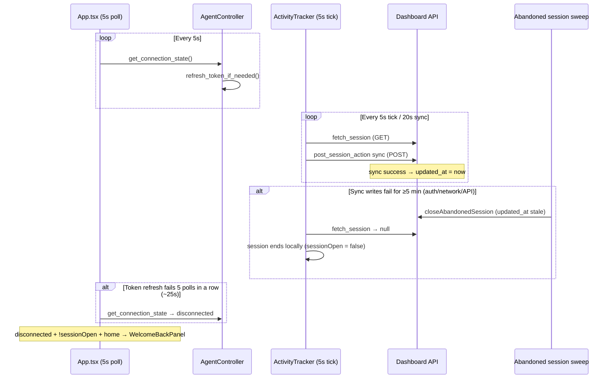

# Investigation: Periodic Reconnect Screen (~every 5 minutes)

## What you're seeing

The full **Welcome back / Reconnect** screen (`WelcomeBackPanel`) replaces the home view when **all** of these are true at once:

```tsx
// App.tsx:1489
(connection === "disconnected" || staleSession) && !sessionOpen && view === "home"
```

| Term | Meaning |
|---|---|
| `connection === "disconnected"` | Rust `get_connection_state()` decided the agent cannot reliably talk to the backend (after 5 consecutive failed token-refresh checks). Device credential exists → recoverable in-app. |
| `staleSession` | `connection === "signedOut"` **but** profile still has a cached JWT → `signedIn === true`. Usually means refresh token is dead and **no device credential** was stored. |
| `!sessionOpen` | Not actively tracking **and** not paused. Timer must be stopped for the full-screen reconnect UI (while tracking, you only get the slim banner). |

Default copy on that screen: *"Your session went idle. Reconnect to pick up where you left off."* — that refers to **auth connectivity**, not keyboard/mouse idle.

---

## Why ~5 minutes is suspicious (not random)

Several independent 5-minute constants exist in this stack. The strongest match for a **recurring ~5 min** pattern is server-side **session abandonment**, not the UI poll interval itself.

| Constant | Value | Location | Role |
|---|---|---|---|
| `SESSION_STALE_MS` | **5 min** | `Dashboard-Backend/.../agent-heartbeat.js:8` | Server force-closes agent sessions whose `updated_at` is older than 5 minutes |
| Abandoned sweep interval | 30 s | `abandoned-session-sweep.service.js:5` | How often the server checks for stale sessions |
| `SESSION_SYNC_INTERVAL_SEC` | 20 s | `Tauri-App-Extension/.../constants.rs:30` | Agent POST `"sync"` cadence — **this is what refreshes `updated_at`** |
| `SESSION_POLL_SEC` | 5 s | `constants.rs:18` | Tracker `fetch_session()` cadence — does **not** refresh `updated_at` |
| UI `refreshGuarded` poll | 5 s | `App.tsx:443-445` | Calls `get_connection_state()` every 5 s |
| `CONNECTION_FAILURE_GRACE` | **5 failures** | `constants.rs:97` | ~25 s of failed refresh checks before UI shows disconnected (5 × 5 s poll) |
| `idle_warn_sec` (org default) | **5 min (300 s)** | scoring settings / `constants.rs:89` | Idle **warning** stage while timer is running — different UI, but same timing users may notice |

**Important:** `GET /api/activity/session` (called every 5 s by the tracker) touches Redis presence via `touchAgentHeartbeat`, but **abandonment uses `activity_sessions.updated_at`**, which is only bumped by session **writes** (`sync`, `start`, `stop`, `pause`, `resume`, etc.) — not by reads.

So a session can look "alive" to the client while the server silently marks it abandoned after **5 minutes without a successful sync write**.

---

## End-to-end flow (most likely compound failure)



**Working hypothesis:** Something periodically breaks **authenticated writes** (or the tracker thread) long enough that:

1. Server closes the session at the **5-minute** stale threshold, stopping the timer (`sessionOpen → false`).
2. Around the same time, `get_connection_state()` reports **`disconnected`** (refresh/network failure).
3. User lands on the full reconnect screen.

Reconnect then succeeds briefly (token refresh or device reauth works), cycle repeats on the next outage.

---

## Code paths to verify (ordered)

### Phase 1 — Confirm trigger (logging / repro)

**Goal:** On the next occurrence, know whether it is (A) connection-only, (B) session-abandonment-only, or (C) both.

1. **Reproduce with agent log open** (`controller.open_log_file` / settings log path).
   - Watch for `"Recovered a session the server closed as abandoned"` (`tracker.rs:1073`).
   - Watch for `"Token refresh network error"` / `"Token refresh rejected"` (`firebase.rs`).
   - Watch for `"[abandoned-session-sweep] closed abandoned desktop-agent session"` on the server.

2. **Note UI state at the moment it happens:**
   - Was the timer running, paused, or stopped?
   - Full WelcomeBackPanel vs slim "Connection lost" banner?
   - Does clicking "Continue as …" fix it immediately?

3. **Correlate timestamps:**
   - Time since last successful sync vs `SESSION_STALE_MS` (5 min).
   - Time since last successful token refresh vs Firebase ID token expiry (~1 h, with 2 min buffer).

### Phase 2 — Connection state false positives

**Files:** `controller.rs:603-632`, `App.tsx:356-362`, `App.tsx:280-291`

| Check | Why |
|---|---|
| `get_connection_state()` only tests `refresh_token_if_needed()`, not `/health` | A valid cached JWT can read as "connected" while POST endpoints fail, or vice versa if refresh fails but GET still works briefly. |
| `CONNECTION_FAILURE_GRACE = 5` at 5 s poll ≈ **25 s** to disconnected | Shorter than 5 min — so sustained reconnect screen also needs **ongoing** refresh failure, not a single blip. |
| **`projectsFailed && assignedTasksFailed` → `setConnection("disconnected")`** (`App.tsx:356-362`) | This bypasses Rust grace logic and never resets connection by itself. If both list endpoints fail together (backend hiccup, 401 burst), UI forces disconnected even when `get_connection_state()` would still return connected on the next poll. **High-priority suspect for "random" reconnect while idle on home screen.** |

### Phase 3 — Session abandonment (5 min server close)

**Files:** `agent-heartbeat.js`, `tracker.rs:714-725`, `tracker.rs:1044-1090`, `session.rs:103-118`

| Check | Why |
|---|---|
| Are `"sync"` POSTs succeeding every ~20 s while tracking? | If sync silently fails, `updated_at` freezes → guaranteed abandonment at 5 min. |
| Tracker thread alive? | Deadlocked/stopped tracker → no sync → 5 min close. (Prior mutex deadlock on `fetch_session` failure was fixed — confirm no regression.) |
| `current_session_info()` uses `fetch_session().unwrap_or(None)` | **Any** fetch error (network **or** unauthorized) is treated as **no session / stopped** in the UI poll — can drop `sessionOpen` even when the tracker still believes it is active. |

### Phase 4 — Auth / device credential

**Files:** `controller.rs:637-711`, `client/api/link.rs`, token store

| Check | Why |
|---|---|
| Is `device_id` + `agent_secret` present in the local token store? | Without it, refresh failure → `signedOut` + `staleSession` → relink UX instead of simple reconnect. |
| Was the agent linked before device credentials existed? | `ensure_device_registered()` runs on token apply, but older installs may lack credentials until next successful link. |
| Firebase config fetch (`auth_url/api/auth/firebase-config`) | If `auth_url` is wrong/unreachable, refresh fails once ID token ages out. `constants.rs` documents a historical misconfiguration (dashboard API vs Auth-Backend). |

### Phase 5 — Rule out idle-timer confusion

**Files:** `tracker.rs:794-900`, `App.tsx:1319-1842`

- Org idle **warn** defaults to **5 min** — emits status `"Idle — no activity detected"` but **does not** open reconnect screen while tracking.
- Idle **stop** defaults to **15 min** — stops timer (`sessionOpen → false`) but still requires bad `connection` for WelcomeBackPanel.
- Include this in user interviews so "reconnect" is not confused with idle banner / timer stop toast.

---

## Likely root causes (ranked)

| # | Hypothesis | Fits ~5 min? | Fits "random"? |
|---|---|---|---|
| 1 | **Sync writes stop updating `updated_at` → server abandons session at 5 min; concurrent auth flakiness → disconnected UI** | **Yes — exact match** | Yes, if network/API is intermittent |
| 2 | **`projectsFailed && assignedTasksFailed` forces `disconnected` in React** | No (not inherently 5 min) | **Yes — can look random on home screen** |
| 3 | **Token refresh / Firebase config failures** | No (usually hourly unless token broken) | Yes |
| 4 | **Missing device credential → staleSession after refresh dies** | No | Yes, especially after restart |
| 5 | **Idle warn at 5 min mistaken for reconnect** | Timing match | Only if user misidentifies UI |

---

## Proposed fix plan (after Phase 1 confirms)

### Quick diagnostics (low risk)

1. Add structured log lines (or temporary debug build) when:
   - `get_connection_state` crosses grace threshold (failure count, `RefreshOutcome`, `has_device`).
   - Last successful sync timestamp vs now (tracker).
   - UI renders WelcomeBackPanel (connection value, sessionOpen, needsRelink).

2. Server-side: log `updated_at` age when abandoning (already partially logged in `closeAbandonedSession`).

### Targeted fixes (depending on finding)

| If confirmed… | Fix direction |
|---|---|
| Sync not updating `updated_at` while tracker runs | Ensure sync failures retry/alert; consider bumping `updated_at` on successful `fetch_session` for open agent sessions, or lengthen/configure `SESSION_STALE_MS` via env (note: `env.js` has `ACTIVITY_SESSION_STALE_MS` default **120 s** but `agent-heartbeat.js` hardcodes **5 min** — reconcile). |
| `projectsFailed && assignedTasksFailed` false disconnect | Remove or narrow that effect; rely on `get_connection_state()` only, or reset to polled state when either list succeeds. |
| `current_session_info` masks errors as stopped | Return last-known session from tracker when fetch fails, same as tracker does mid-session. |
| Missing device credential | Migration/on-startup prompt to re-link once; ensure all sign-in paths call `ensure_device_registered`. |
| Connection vs session conflated in UX | Don't require `!sessionOpen` for reconnect banner when tracking; or auto-call `reconnect()` before showing full-screen panel. |

### Tests to add

- Rust: `get_connection_state` grace counter resets on success; does not flip on single failure.
- Rust: sync failure for N ticks → assert server would see stale `updated_at` (integration with mock server).
- Frontend: `projectsFailed && assignedTasksFailed` does not override a connected `get_connection_state`.
- Backend: existing `session-abandonment.test.js` — add case for "GET session without sync for 5 min → abandoned".

---

## Immediate questions for the reporter

1. Does it happen **while the timer is running**, or only when stopped / on break / before starting?
2. Full **Welcome back** screen or the small **Connection lost** banner at the bottom?
3. After clicking reconnect, how long until it happens again — strictly ~5 min or irregular?
4. Windows desktop agent? (Idle hooks are Windows-only; unrelated to reconnect but helps context.)
5. Any pattern: VPN, sleep/wake, Wi‑Fi drops, specific time of day?

---

## Key file index

| Area | Path |
|---|---|
| Reconnect screen gate | `src/App.tsx:1489-1500` |
| Connection poll | `src/App.tsx:443-445`, `280-291` |
| Forced disconnect hack | `src/App.tsx:356-362` |
| Connection state logic | `src-tauri/src/agent/controller.rs:603-711` |
| Token refresh | `src-tauri/src/client/api/mod.rs:157-191` |
| Session fetch / false stopped | `src-tauri/src/client/api/session.rs:25-40`, `103-118` |
| Sync cadence | `src-tauri/src/agent/tracker.rs:714-725` |
| Abandonment threshold | `Dashboard-Backend/src/modules/activity/agent-heartbeat.js:8-40` |
| Abandonment sweep | `Dashboard-Backend/src/modules/activity/abandoned-session-sweep.service.js` |

---

## Summary

The reconnect screen is **not** on a 5-minute timer by itself — it needs **`connection !== connected`** (or stale signed-out session) **and** **`sessionOpen === false`**. The codebase **does** have a hard **5-minute server rule** that closes sessions without a recent sync write, which stops the timer and aligns with the user's timing. The most probable story is a **sync/auth write path failing intermittently**, causing both session abandonment (~5 min) and connection degradation (~25 s sustained), which together produce the Welcome back screen. Phase 1 logging should confirm which leg fails first; the `projectsFailed && assignedTasksFailed` React override is a separate, easy-to-hit trigger worth fixing regardless.
