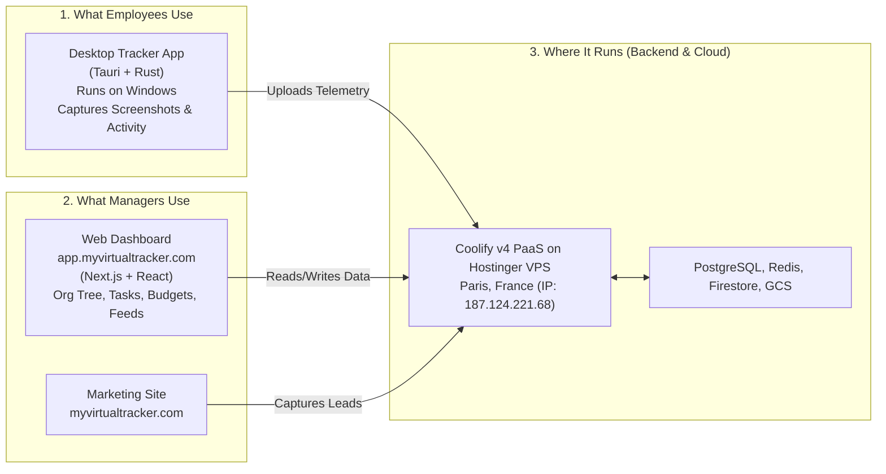
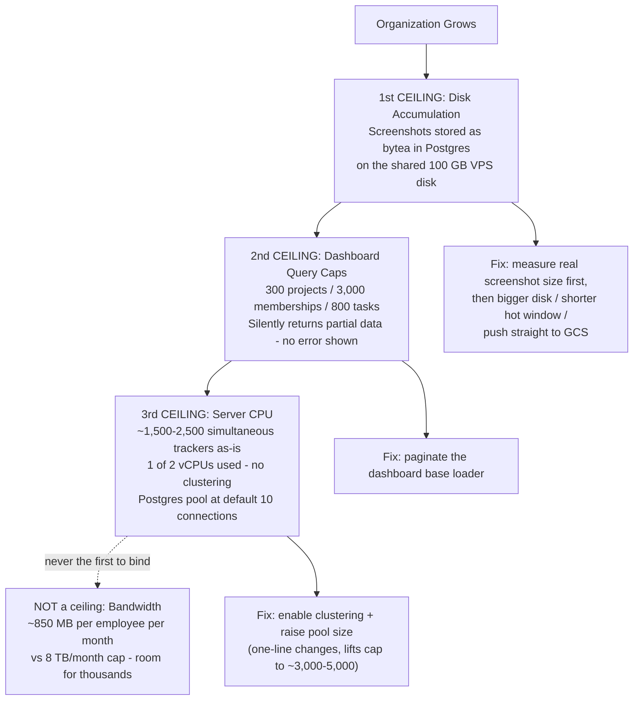
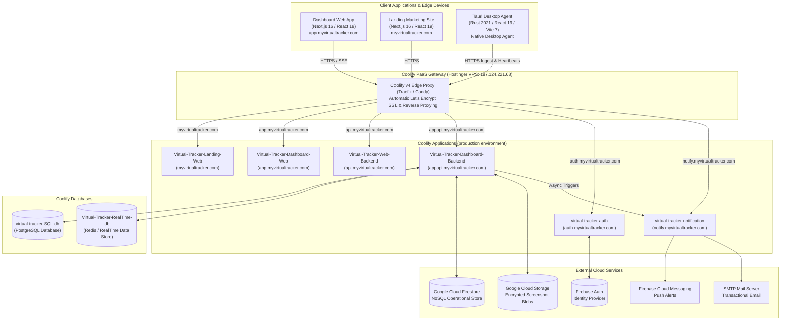
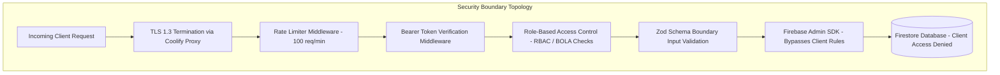
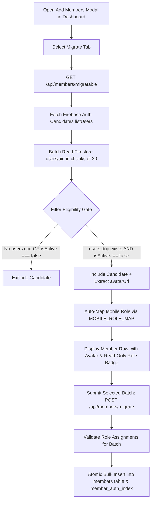
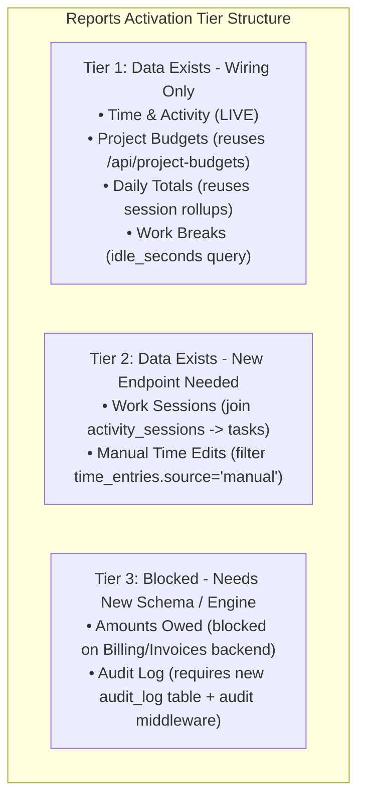
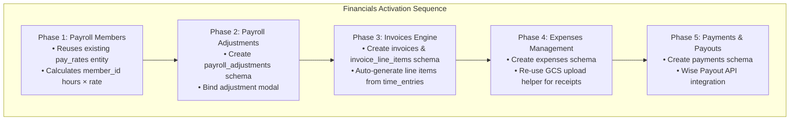
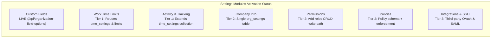
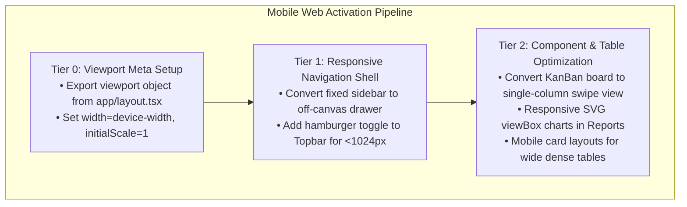
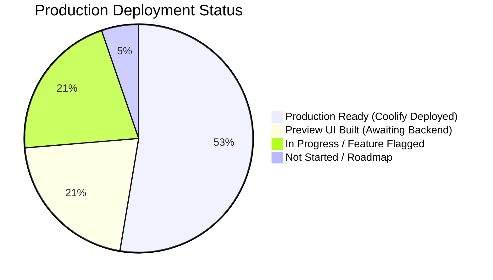

# Virtual Tracker — Master Technical Architecture & Complete System Specification

> **Document Version**: 6.0.0  
> **Classification**: Internal Engineering & System Architecture Specification  
> **Target Audience**: Core Engineers, System Architects, DevOps Teams, Product Leads  
> **Production Infrastructure**: Hostinger KVM 2 VPS (Paris, France, IP `187.124.221.68`) Managed via Coolify v4 PaaS  
> **Live Production Domain**: `myvirtualtracker.com` and subdomains  
> **Scope**: Complete end-to-end documentation covering plain-English system overview, microservice design, Next.js web applications, Tauri 2 Rust desktop agent, database schemas (Firestore, Postgres, Redis, GCS), zero-trust security model, complete API catalog, Coolify PaaS deployment, module activation blueprints (Reports, Financials, Settings, Mobile Web), administrative CLI tools, and production deployment operations.

---

## Table of Contents

1. [Chapter 1: Plain-English System Overview & Executive Cheat Sheet](#chapter-1-plain-english-system-overview--executive-cheat-sheet)
2. [Chapter 2: System Mission & Domain Engineering](#chapter-2-system-mission--domain-engineering)
3. [Chapter 3: Master System Architecture & Global Topology](#chapter-3-master-system-architecture--global-topology)
4. [Chapter 4: Coolify PaaS Infrastructure & Live Production Architecture](#chapter-4-coolify-paas-infrastructure--live-production-architecture)
5. [Chapter 5: Backend Microservices Deep-Dive Architecture](#chapter-5-backend-microservices-deep-dive-architecture)
   - [5.1 Auth-Backend (`virtual-tracker-auth`)](#51-auth-backend-virtual-tracker-auth)
   - [5.2 Dashboard-Backend (`Virtual-Tracker-Dashboard-Backend`) & Module Catalog](#52-dashboard-backend-virtual-tracker-dashboard-backend--module-catalog)
   - [5.3 Web-Backend Gateway (`Virtual-Tracker-Web-Backend`)](#53-web-backend-gateway-virtual-tracker-web-backend)
   - [5.4 Landing-Backend (`vt-landing-backend`)](#54-landing-backend-vt-landing-backend)
   - [5.5 Notification Service (`virtual-tracker-notification`)](#55-notification-service-virtual-tracker-notification)
6. [Chapter 6: Frontend Web Applications Deep-Dive Architecture](#chapter-6-frontend-web-applications-deep-dive-architecture)
   - [6.1 Dashboard-Web (`Virtual-Tracker-Dashboard-Web`)](#61-dashboard-web-virtual-tracker-dashboard-web)
   - [6.2 Landing-Web (`Virtual-Tracker-Landing-Web`)](#62-landing-web-virtual-tracker-landing-web)
7. [Chapter 7: Tauri Desktop Agent Deep-Dive Specification (`vt-agent`)](#chapter-7-tauri-desktop-agent-deep-dive-specification-vt-agent)
8. [Chapter 8: Comprehensive Data Schemas & Managed Database Topology](#chapter-8-comprehensive-data-schemas--managed-database-topology)
9. [Chapter 9: Security Architecture, Threat Modeling & Defense-in-Depth](#chapter-9-security-architecture-threat-modeling--defense-in-depth)
10. [Chapter 10: Mobile-App User Migration Architecture & Blueprint](#chapter-10-mobile-app-user-migration-architecture--blueprint)
11. [Chapter 11: Complete API Endpoint Reference Catalog & Payloads](#chapter-11-complete-api-endpoint-reference-catalog--payloads)
12. [Chapter 12: Comprehensive Environment Variable & Configuration Matrix](#chapter-12-comprehensive-environment-variable--configuration-matrix)
13. [Chapter 13: Administrative Scripts, Tooling & System Runbooks](#chapter-13-administrative-scripts-tooling--system-runbooks)
14. [Chapter 14: Reports Module Activation Plan & Data Readiness Roadmap](#chapter-14-reports-module-activation-plan--data-readiness-roadmap)
15. [Chapter 15: Financials Module Activation Plan & Data Readiness Roadmap](#chapter-15-financials-module-activation-plan--data-readiness-roadmap)
16. [Chapter 16: Settings & Administration Activation Blueprint](#chapter-16-settings--administration-activation-blueprint)
17. [Chapter 17: Mobile Web & Responsive Viewport Activation Plan](#chapter-17-mobile-web--responsive-viewport-activation-plan)
18. [Chapter 18: Coolify PaaS Operations & Deployment Manual](#chapter-18-coolify-paas-operations--deployment-manual)
19. [Chapter 19: Granular Feature Implementation Matrix & System Roadmap](#chapter-19-granular-feature-implementation-matrix--system-roadmap)

---

## Chapter 1: Plain-English System Overview & Executive Cheat Sheet

### What is Virtual Tracker in 3 Sentences?
**Virtual Tracker** is an all-in-one employee time-tracking, activity analytics, team org-chart, and project management platform. Employees track their work using a lightweight desktop application that records active windows, keyboard/mouse activity, and periodic screenshots. Managers use a central web dashboard to view live team activity, monitor project budgets, manage reporting hierarchies, and schedule automated weekly reports.



### High-Level Component Cheat Sheet

| Component Name | What It Does (In Simple Terms) | Where It Lives / Public Link | Tech Stack Used |
| :--- | :--- | :--- | :--- |
| **Landing Web** | Marketing site for visitors to learn about the product and submit contact inquiries. | `https://myvirtualtracker.com` | Next.js 16, React 19, Tailwind CSS |
| **Dashboard Web** | The primary web app where managers view time logs, task boards, org trees, and budgets. | `https://app.myvirtualtracker.com` | Next.js 16, Radix UI, Visx, dnd-kit |
| **Desktop Agent** | Windows desktop app employees run to track time, capture screenshots, and log activity. | Local Windows Install | Tauri v2, Rust 2021, Vite 7, React 19 |
| **Auth Backend** | Verifies user logins, password security policies, and token validity via Firebase. | `https://auth.myvirtualtracker.com` | Node.js 20, Express, Firebase Admin |
| **Dashboard Backend**| The main API server running all business rules: time entries, projects, org tree, tasks, presence. | `https://appapi.myvirtualtracker.com` | Node.js 20, Express, Firestore, Postgres |
| **Web Gateway API** | The main gateway proxy routing traffic from web clients to backend services. | `https://api.myvirtualtracker.com` | Node.js 20, Express |
| **Notification Service**| Sends emails (welcome, budget alerts), push notifications, and SMS messages asynchronously. | `https://notify.myvirtualtracker.com` | Node.js 20, Nodemailer, FCM, SMS |
| **SQL Database** | Relational database holding fast lookup indices, budgets, time entries, and task links. | Internal (`virtual-tracker-SQL-db`) | PostgreSQL 16 Alpine |
| **RealTime Database** | In-memory store for tracking live who's-online presence and active user sessions. | Internal (`Virtual-Tracker-RealTime-db`)| Redis 7 Alpine |

### How Data Flows Through the App

1. **Employee starts tracking time**: The employee opens the desktop app and clicks "Start Tracking".
2. **Activity is recorded**: Every 90–210 seconds (randomised, averaging ~2.5 minutes) the desktop app takes a screenshot; separately it measures mouse/keyboard activity and checks the active window title (e.g. `VS Code`) every 15 seconds, sending this payload securely to `appapi.myvirtualtracker.com`.
3. **Storage**: The backend writes recent screenshots as binary data **directly into PostgreSQL** (the `image_data` column) and saves session metadata into Google Cloud Firestore and PostgreSQL. Google Cloud Storage holds only *archived* screenshots, moved there by the retention job once they age out of the hot window.
4. **Manager views the feed**: A manager logs into `app.myvirtualtracker.com`, views the Activity feed, sees real-time screenshots, and checks project budget depletion.
5. **Presence**: When users are online, Redis streams live status updates so managers see who is working in real time.

### How Many People Can Use It At Once? (Capacity & Scalability)

There are two different "how many users" questions, and they have very different answers:

1. **How many employees can actively track time at the same moment?** — limited by server hardware.
2. **How large can one company's account get?** — limited by page-size caps written into the code.

> **Important:** the figures below are **engineering estimates derived from the code's own timing constants and the VPS specification** — they are *not* results of a load test. No load testing has been performed on this system yet. Treat them as planning guidance and validate with a real load test before committing to a customer SLA.

#### Answer 1: Simultaneous Tracking — comfortably into the **several hundreds**

Live concurrency is **not** the tight constraint on this system, because the desktop agent is deliberately quiet. Each actively-tracking employee sends only about **7–8 requests per minute**:

| What the desktop app sends | How often | Requests/min | Where this comes from |
| :--- | :--- | :--- | :--- |
| Activity / app-log events | every 15 seconds | 4.0 | `APP_LOG_INTERVAL_SEC` |
| Session sync | every 20 seconds | 3.0 | `SESSION_SYNC_INTERVAL_SEC` |
| Screenshot upload | every 90–210 s (avg ~150 s) | ~0.4 | `SCREENSHOT_MIN/MAX_DELAY_SEC` |
| **Total per tracking employee** | — | **~7.4** | ≈ 0.12 requests/second |

That works out to a very manageable server load:

| Employees tracking at once | Requests/second reaching the backend | Screenshot write throughput | Load on this specific server |
| :--- | :--- | :--- | :--- |
| 200 | ~25 /s | ~0.1–0.2 MB/s | Light — barely registers |
| 500 | ~62 /s | ~0.3–0.5 MB/s | Comfortable |
| 1,000 | ~123 /s | ~0.6–1.0 MB/s | Moderate, still healthy headroom |
| **1,500–2,500** | **~185–310 /s** | **~1.0–2.5 MB/s** | **Estimated ceiling as currently configured** |
| 3,000–5,000 | ~370–620 /s | ~2–4 MB/s | Reachable *only after* the two fixes below |

**Where the ~1,500–2,500 ceiling comes from.** The VPS has **2 vCPU cores in total**, and those two cores are shared by everything on the box — all six application containers, PostgreSQL, and Redis. Two specifics decide the cap:

* The Dashboard-Backend runs as a **single Node.js process with no clustering** (no `cluster` or `worker_threads` usage anywhere in `src/`), so it can only ever occupy **one of the two cores**, no matter how busy it gets. That single core has to absorb every incoming request while PostgreSQL competes for the other core to execute the writes.
* The PostgreSQL pool is created as `new pg.Pool({ connectionString })` with **no `max` specified**, leaving it at the driver default of **10 connections**. Every concurrent query must borrow one of those 10 slots, so once average query latency rises under load, this queue is the first thing to back up.

Applying a normal production safety margin (you would not plan to run a single core at 100% sustained), the derived ceiling for the current configuration is roughly **1,500–2,500 simultaneously tracking employees**. Both limits above are **one-line configuration changes**, not rewrites — enabling clustering to use the second core and raising the pool size should move the ceiling into the **3,000–5,000** range before any hardware upgrade is needed.

> **The key takeaway:** this concurrency ceiling sits *far above* the storage ceiling described next. In practice you would run out of **disk space** long before you ran out of CPU — which is why this system comfortably handles employee counts well beyond a few hundred, and why disk is the number worth watching.

#### Answer 2: Storage Accumulation — the real ceiling, and it depends on screenshot size

The constraint that actually bites is **cumulative disk usage**, which is a different question from concurrency: it's driven by how much screenshot data piles up across the retention window, not by how many people are online at any one instant.

Recent screenshots are stored as binary data directly inside PostgreSQL (the `image_data` column) on the VPS's own disk; only *aged-out* screenshots are moved to Google Cloud Storage by the archive job. So the "hot" retention window consumes local disk, and the 100 GB disk is shared with the OS, Docker images, Redis, and all six application containers — realistically leaving **~50–60 GB** for screenshots.

At ~192 screenshots per employee per 8-hour day and a 3-week hot window (~15 working days), capacity is **highly sensitive to the average compressed screenshot size** — and because screenshots are mostly flat UI, text, and solid colours rather than photographic detail, real-world sizes at 1280 px / quality 72 land well below photographic equivalents:

| Avg screenshot size | Storage per employee (3-week hot window) | Employees supported at 50 GB | at 60 GB |
| :--- | :--- | :--- | :--- |
| 150 KB (pessimistic) | ~432 MB | ~115 | ~140 |
| 100 KB | ~288 MB | ~175 | ~210 |
| **75 KB (typical UI screenshot)** | **~216 MB** | **~235** | **~285** |
| 50 KB (text-heavy, compresses well) | ~144 MB | ~355 | ~425 |

Two further factors push the real number **higher** than the table suggests: employees rarely track a full 8 hours every working day (at a 6-hour average, multiply capacity by ~1.33), and the archive job continuously moves older rows out to GCS, freeing local disk as it goes.

> **To pin this down properly:** the single most useful measurement is the **average byte size of rows in the screenshot table in production**. That one number converts the range above into a firm figure. A load test would confirm the concurrency side.

#### Answer 3: Company Size — practical ceiling around **300 projects / 3,000 project memberships**

Independently of how many people track at once, the dashboard's data-loading queries have **fixed page-size caps written into the code**. Beyond these, the dashboard does not slow down or error — it **silently displays incomplete data**, which is arguably worse:

| Data type | Hard cap in code | Consequence once exceeded |
| :--- | :--- | :--- |
| Projects | 300 | Projects beyond #300 vanish from dashboard totals |
| Project budgets | 300 | Budget roll-ups become incomplete |
| Project memberships | 3,000 | Team assignments silently missing |
| Tasks | 800 | Task counts and completion % understated |
| Activity sessions | 500 | Activity feed misses older sessions |

These caps live in `Dashboard-Backend/src/modules/dashboard/dashboard-base-loader.js`. For a single organization of a few hundred employees this is comfortable. A multi-thousand-employee deployment would show wrong numbers until these queries are paginated properly.

#### What Breaks First As You Grow



### Quick Status Overview: What's Working vs What's Next

* ✅ **100% Live & Deployed**: Desktop Agent screen capture, Login/Auth, Time Tracking, Real-time Presence, Interactive Org Chart, KanBan Task Board, Mobile User Migration, Time & Activity Reports.
* 🟡 **UI Built, Awaiting Backend Binding**: Invoices & Financials, Project Budgets Report, Daily Totals Report, Custom Work Time Limits, Subscription Billing settings.
* 🔴 **Future Roadmap**: Time Off module, Wise payment payouts, native macOS agent.

---

## Chapter 2: System Mission & Domain Engineering

**Virtual Tracker** is an enterprise-grade, distributed employee time-tracking, activity analytics, organization hierarchy, project management, and budget oversight platform. Designed for modern remote workforce management and containerized cloud deployment, Virtual Tracker bridges real-time desktop telemetry (screenshot capture, active application monitoring, mouse/keyboard input scoring) with high-level corporate governance (dynamic org charts, multi-tiered billing budgets, automated weekly reports).

### Core Architectural Pillars
* **Coolify PaaS Self-Hosted Orchestration**: Full container automation, automated SSL certificates via Let's Encrypt, environment variable isolation, and zero-downtime rolling updates deployed directly on Ubuntu 24.04 LTS.
* **High-Precision Native Desktop Telemetry**: Built on Tauri v2 and Rust, the desktop agent operates with minimal memory footprint (~25MB RAM), utilizing native OS hardware encryption (Windows DPAPI) for local credential storage and low-overhead screen capture engines (`xcap`).
* **Visual Organizational Governance**: Multi-tiered hierarchy management supporting real-time tree visualization (via `@visx/hierarchy`), manager reassignment workflows, reporting-line validation, and automated background link repair routines.
* **Granular Multi-Modal Budgeting**: Project and client budget calculation supporting Hourly, Fixed, and Retainer caps, with threshold alerts (80%, 90%, 100%) delivered asynchronously across email, push, and SMS channels.
* **Zero-Trust Security & Boundary Isolation**: Full structural decoupling of authentication (AuthN) and authorization (AuthZ). Firestore client rules enforce zero-trust (`allow read, write: if false;`), ensuring all data access is gated by Node.js backend validation middleware using the Firebase Admin SDK.

---

## Chapter 3: Master System Architecture & Global Topology

Virtual Tracker is orchestrated via **Coolify v4** running on a Hostinger KVM 2 VPS in Paris, France. The production network uses Traefik / Caddy edge proxying to route public SSL subdomains to internal application containers.



---

## Chapter 4: Coolify PaaS Infrastructure & Live Production Architecture

### 4.1 Live Production Hardware & Hosting Specifications

| Attribute | Production Configuration Detail |
| :--- | :--- |
| **PaaS Platform** | **Coolify v4.1.2** |
| **VPS Provider** | **Hostinger Cloud (KVM 2 Plan)** |
| **Server Location** | **France - Paris (EU West)** |
| **Operating System** | **Ubuntu 24.04 LTS (64-bit)** |
| **Host Name** | `srv1786115.hstgr.cloud` |
| **Public IPv4 Address** | `187.124.221.68` |
| **CPU Resources** | **2 vCPU Cores** |
| **System Memory (RAM)** | **8 GB RAM** |
| **NVMe Disk Storage** | **100 GB Disk Space** |
| **Monthly Bandwidth** | **8 TB Transfer Cap** |
| **Coolify Project / Environment** | `Virtual-Tracker / production` |

### 4.2 Live Deployed Applications Directory

| Application / Resource Name | Coolify Tag | Live Production URL | Role & Primary Function |
| :--- | :--- | :--- | :--- |
| **`Virtual-Tracker-Landing-Web`** | `web` | `https://myvirtualtracker.com` | Public marketing site, pricing, client acquisition, contact form. |
| **`Virtual-Tracker-Dashboard-Web`** | `web`, `app` | `https://app.myvirtualtracker.com` | Main user dashboard, Org Chart tree, KanBan board, member list. |
| **`Virtual-Tracker-Web-Backend`** | — | `https://api.myvirtualtracker.com` | Web API gateway forwarding and public routing. |
| **`Virtual-Tracker-Dashboard-Backend`**| — | `https://appapi.myvirtualtracker.com` | Primary operational domain API, time tracking, org hierarchy, reports. |
| **`virtual-tracker-auth`** | `authn` | `https://auth.myvirtualtracker.com` | Firebase authentication verification, password policy, readiness probes. |
| **`virtual-tracker-notification`** | `notifications` | `https://notify.myvirtualtracker.com` | Multi-channel async dispatch (Email via SMTP, FCM push, SMS). |
| **`virtual-tracker-SQL-db`** | `db` | Internal (`localhost:5432`) | Production PostgreSQL relational database engine. |
| **`Virtual-Tracker-RealTime-db`** | — | Internal (`localhost:6379`) | Production Redis / Real-Time status database engine. |

---

## Chapter 5: Backend Microservices Deep-Dive Architecture

### 5.1 Auth-Backend (`virtual-tracker-auth`)

* **Live Domain**: `https://auth.myvirtualtracker.com`
* **File Location**: [Auth-Backend](file:///x:/Work/Virtual-Tracker-Test/Virtual-Tracker/Auth-Backend)
* **Runtime**: Node.js `>=20.6` (ES Modules)
* **Dependencies**: `firebase-admin ^13.8.0`, `zod ^3.25.76`

---

### 5.2 Dashboard-Backend (`Virtual-Tracker-Dashboard-Backend`) & Module Catalog

* **Live Domain**: `https://appapi.myvirtualtracker.com`
* **File Location**: [Dashboard-Backend](file:///x:/Work/Virtual-Tracker-Test/Virtual-Tracker/Dashboard-Backend)
* **Runtime**: Node.js `>=20.6` (ES Modules with `--use-system-ca`)
* **Dependencies**: `firebase-admin ^13.8.0`, `pg ^8.16.3`, `ioredis ^5.11.1`, `sharp ^0.35.3`, `pdfkit ^0.19.1`, `archiver ^7.0.1`, `ws ^8.21.0`, `zod ^3.25.76`

#### Granular Analysis of 14 Feature Modules

1. **`activity`**: Session start/stop events, screenshot uploads, activity score logs. Runs `scheduleAbandonedSessionSweep()` and 3-week active / 7-day zip retention sweeps.
2. **`auth`**: Post-auth identity bootstrapping (`/api/auth/session-bootstrap`), first-login profile completion, profile photo avatar uploads to GCS, and access request queues.
3. **`bootstrap`**: Executes `scheduleOrganizationMaintenance()` on startup to detect broken org links and verify system integrity.
4. **`clients`**: Client entity CRUD, billing rate cards, invoicing configuration, and client budget caps (Hourly, Fixed, Retainer). Computes `shouldRunAutoInvoice`.
5. **`hierarchy`**: Reporting line creation, parent-child links, manager transfer requests (`acceptMemberTransferRequest`), and cycle prevention (`relationship-integrity.js`).
6. **`member-onboarding`**: Onboarding checklists, progress tracking, automated reminder emails (`/api/member-onboarding/reminder`). Excludes Owner roles.
7. **`member-relationships`**: Relationship tree builder supporting direct reporting link queries, descendant lookups, and manager reassignment.
8. **`members`**: Member directory CRUD, role assignments (`role-assignment-guard.js`), member deactivation/bans, bulk member operations, employee ID generation (`generateMemberEmployeeId`), and **Mobile User Migration** (`/api/members/migratable`, `/api/members/migrate`).
9. **`notifications`**: In-app notification center store, read/unread status updates, and delivery preferences.
10. **`presence`**: Real-time online/away status gateway (`initPresenceGateway`) using SSE backed by Redis Pub/Sub / RealTime database.
11. **`projects`**: Project entity CRUD, member assignments, project budget aggregation from client budgets (`aggregateProjectBudgetFromClients`), and budget depletion alerting.
12. **`reports`**: Automated weekly team reports (`scheduleTeamWeeklyReports`), PDF report generation (`pdfkit`), report schedule runner (`scheduleReportDeliveries`), and export engines.
13. **`tasks`**: Task CRUD, drag-and-drop position reordering, task assignment review queues, single active timer constraint per user, board/list/calendar dataset transformations.
14. **`teams`**: Team entity creation, team lead allocations, member rosters, and weekly team aggregation reports.

---

### 5.3 Web-Backend Gateway (`Virtual-Tracker-Web-Backend`)

* **Live Domain**: `https://api.myvirtualtracker.com`
* **Role**: Primary unified API gateway routing external client traffic to `virtual-tracker-auth` (`:5712`) and `Virtual-Tracker-Dashboard-Backend` (`:5713`).

---

### 5.4 Landing-Backend (`vt-landing-backend`)

* **File Location**: [Landing-Backend](file:///x:/Work/Virtual-Tracker-Test/Virtual-Tracker/Landing-Backend)
* **Role**: Processes contact form inquiries from `Virtual-Tracker-Landing-Web` and forwards validated lead objects to `Dashboard-Backend`.

---

### 5.5 Notification Service (`virtual-tracker-notification`)

* **Live Domain**: `https://notify.myvirtualtracker.com`
* **File Location**: [Notify-backend](file:///x:/Work/Virtual-Tracker-Test/Virtual-Tracker/Notify-backend)
* **Role**: Asynchronous multi-channel notification dispatch engine (Nodemailer SMTP, Firebase Cloud Messaging push, SMS).

---

## Chapter 6: Frontend Web Applications Deep-Dive Architecture

### 6.1 Dashboard-Web (`Virtual-Tracker-Dashboard-Web`)

* **Live Domain**: `https://app.myvirtualtracker.com`
* **File Location**: [Dashboard-Web](file:///x:/Work/Virtual-Tracker-Test/Virtual-Tracker/Dashboard-Web)
* **Framework**: Next.js 16 + React 19 + TypeScript 5.7
* **Styling & UI**: Tailwind CSS v4, Radix UI primitives, Shadcn UI, Lucide React icons, Framer Motion, GSAP, Sonner toasts.
* **Data Visualization**: Visx (`@visx/hierarchy`, `@visx/shape`, `@visx/group`) for dynamic Org Chart trees, Recharts for project and budget telemetry.
* **Drag and Drop**: `@dnd-kit/core`, `@dnd-kit/sortable`, `@dnd-kit/utilities` for task KanBan board reordering.

---

### 6.2 Landing-Web (`Virtual-Tracker-Landing-Web`)

* **Live Domain**: `https://myvirtualtracker.com`
* **File Location**: [Landing-Web](file:///x:/Work/Virtual-Tracker-Test/Virtual-Tracker/Landing-Web)
* **Framework**: Next.js 16 + React 19 + Tailwind CSS
* **Role**: Public marketing site detailing platform capabilities, security compliance, client testimonial features, and contact form integration. Shared auth state sync keeps login state synchronized with `Dashboard-Web`.

---

## Chapter 7: Tauri Desktop Agent Deep-Dive Specification (`vt-agent`)

The desktop tracking application (`virtual-tracker-agent`) is built using **Tauri v2** with a Rust native core and a React 19 / Vite frontend UI.

* **File Location**: [Tauri-App-Extension](file:///x:/Work/Virtual-Tracker-Test/Virtual-Tracker/Tauri-App-Extension)
* **Version**: `0.4.0`
* **Rust Dependencies (`Cargo.toml`)**:
  - `tauri = { version = "2", features = ["tray-icon"] }`
  - `xcap = "0.3"` — High-performance cross-platform screen capture.
  - `image = "0.25"` — JPEG compression and quality encoding.
  - `tiny_http = "0.12"` — Embedded HTTP server for deep-link auth exchange on localhost `:18890`.
  - `windows = "0.58"` — Win32 APIs for DPAPI crypto, window handles, and active process titles.
  - `tauri-plugin-updater = "2"` — Background autoupdater verified via Ed25519 signature keys (`updater-key.pem.pub`).

---

## Chapter 8: Comprehensive Data Schemas & Managed Database Topology

### 8.1 Managed PostgreSQL Database (`virtual-tracker-SQL-db`)

* **Coolify Managed Container**: `virtual-tracker-SQL-db`
* **Version**: PostgreSQL 16 Alpine
* **Internal Connection**: `virtual-tracker-SQL-db:5432`

#### Core Table Definitions
* **`project_budgets`**: `id` (UUID, PK), `project_id` (VARCHAR), `cost` (NUMERIC), `type` (VARCHAR), `based_on` (VARCHAR: `per_person`, `per_project`, `total`), `include_non_billable_time` (BOOLEAN).
* **`time_entries`**: `id` (UUID, PK), `member_id` (VARCHAR), `project_id` (VARCHAR), `task_id` (VARCHAR), `duration` (INTEGER in seconds), `start_time` (TIMESTAMPTZ), `end_time` (TIMESTAMPTZ).
* **`task_assignments`**: `id` (UUID, PK), `task_id` (VARCHAR), `member_id` (VARCHAR), `status` (VARCHAR: `todo`, `in_progress`, `in_review`, `blocked`, `done`), `updated_at` (TIMESTAMPTZ).
* **`member_relationships`**: `id` (UUID, PK), `parent_member_id` (VARCHAR), `child_member_id` (VARCHAR), `created_at` (TIMESTAMPTZ).

---

### 8.2 Managed Redis / Real-Time Database (`Virtual-Tracker-RealTime-db`)

* **Coolify Managed Container**: `Virtual-Tracker-RealTime-db`
* **Version**: Redis 7 Alpine
* **Internal Connection**: `Virtual-Tracker-RealTime-db:6379`

---

### 8.3 Firestore Document Collections Schema & Zero-Trust Rules

```javascript
rules_version = '2';

// Defense-in-depth: all Firestore access is via the Node backend (Admin SDK).
// Client SDK reads/writes are denied even if accidentally enabled in the frontend.
service cloud.firestore {
  match /databases/{database}/documents {
    match /{document=**} {
      allow read, write: if false;
    }
  }
}
```

---

## Chapter 9: Security Architecture, Threat Modeling & Defense-in-Depth



---

## Chapter 10: Mobile-App User Migration Architecture & Blueprint



---

## Chapter 11: Complete API Endpoint Reference Catalog & Payloads

### Production Hostnames Reference
* `https://auth.myvirtualtracker.com` (Auth Backend)
* `https://appapi.myvirtualtracker.com` (Dashboard Backend)
* `https://api.myvirtualtracker.com` (Web Gateway API)
* `https://app.myvirtualtracker.com` (Dashboard Web App)
* `https://myvirtualtracker.com` (Landing Site)
* `https://notify.myvirtualtracker.com` (Notification Service)

#### `GET https://auth.myvirtualtracker.com/health`
```json
{
  "status": "ok",
  "timestamp": "2026-08-02T16:20:00.000Z",
  "service": "vt-auth-backend"
}
```

#### `POST https://appapi.myvirtualtracker.com/api/activity/screenshot`
```json
{
  "memberId": "mem_01HGBZ",
  "projectId": "prj_1001",
  "taskId": "tsk_5544",
  "activeSeconds": 600,
  "keyboardEvents": 412,
  "mouseEvents": 890,
  "activeWindowApp": "code.exe",
  "activeWindowTitle": "Project-detailed-doc.md - Virtual-Tracker",
  "screenshotBase64": "/9j/4AAQSkZJRgABAQ..."
}
```

---

## Chapter 12: Comprehensive Environment Variable & Configuration Matrix

| Variable Name | Target Service | Production Live Value / Description |
| :--- | :--- | :--- |
| `PORT` | All Backends | Dynamic Coolify assignment (`5712`, `5713`, `5714`, `3000`). |
| `NODE_ENV` | All Services | `production` |
| `FIREBASE_PROJECT_ID` | Auth, Dashboard, Notify | Production Firebase project ID. |
| `FIREBASE_CLIENT_EMAIL` | Auth, Dashboard, Notify | Firebase Admin service account email. |
| `FIREBASE_PRIVATE_KEY` | Auth, Dashboard, Notify | RSA Private Key string. |
| `POSTGRES_HOST` | Dashboard-Backend | `virtual-tracker-SQL-db` (Coolify internal network). |
| `POSTGRES_PORT` | Dashboard-Backend | `5432` |
| `POSTGRES_DB` | Dashboard-Backend | Production PostgreSQL DB name. |
| `POSTGRES_USER` | Dashboard-Backend | Production PostgreSQL DB username. |
| `POSTGRES_PASSWORD` | Dashboard-Backend | Production PostgreSQL DB password. |
| `REDIS_URL` | Dashboard-Backend | `redis://Virtual-Tracker-RealTime-db:6379` |
| `GCS_BUCKET_NAME` | Dashboard-Backend | Google Cloud Storage Bucket for screenshots. |
| `NEXT_PUBLIC_API_URL` | Dashboard-Web | `https://api.myvirtualtracker.com` |
| `NEXT_PUBLIC_AUTH_API_URL` | Dashboard-Web | `https://auth.myvirtualtracker.com` |
| `NEXT_PUBLIC_DASHBOARD_API_URL` | Dashboard-Web | `https://appapi.myvirtualtracker.com` |

---

## Chapter 13: Administrative Scripts, Tooling & System Runbooks

* `assign-owner.mjs` (`Dashboard-Backend/scripts/assign-owner.mjs`): Grants Owner role to target email.
* `verify-user-email.mjs`: Sets `emailVerified = true` on Firebase Auth account.
* `archive-screenshots.mjs`: Triggers 3-week screenshot cleanup and weekly zip archiving.
* `lint-env-access.mjs`: Asserts all environment variable reads pass schema validation.
* `sync-firebase-local.mjs`: Syncs local dev Firebase configs.

---

## Chapter 14: Reports Module Activation Plan & Data Readiness Roadmap

The Reports module contains 8 distinct report types. While **Time & Activity** is fully activated with live PostgreSQL backend pipelines, the remaining 7 reports require targeted activation steps based on current data readiness.



### 14.1 Tier-by-Tier Report Activation Roadmap

#### Tier 1 — Data Exists (Wiring Only)
1. **Time & Activity Report**:
   - **Status**: ✅ **100% Live & Functional**.
   - **Engine**: Implemented via `Dashboard-Backend/src/modules/reports/routes.js` with Postgres aggregations, CSV/PDF export, and scheduled email delivery.
2. **Project Budgets Report**:
   - **Current State**: Renders hardcoded `PROJECT_BUDGETS_DEMO_SECTIONS`.
   - **Activation Step**: Replace demo constants with a call to `GET /api/project-budgets` (which already uses `computeProjectSpentForAllPg`). Frontend-only change.
3. **Daily Totals Report**:
   - **Current State**: Renders hardcoded demo rows.
   - **Activation Step**: Consume `GET /api/reports/time-and-activity` and aggregate per-member active/idle seconds into daily calendar totals. Reuses existing day-bucketing logic in `build-time-and-activity-rows.js`.
4. **Work Breaks Report**:
   - **Current State**: Empty-state placeholder.
   - **Activation Step**: Render UI table and query `idle_seconds` from `activity_sessions` (already collected during tracking).

#### Tier 2 — Data Exists (New Query / Endpoint Required)
1. **Work Sessions Report**:
   - **Activation Step**: Create `GET /api/reports/work-sessions` joining `activity_sessions` $\rightarrow$ `tasks` $\rightarrow$ `projects` $\rightarrow$ `client_projects` for detailed per-session start/stop logs.
2. **Manual Time Edits Report**:
   - **Activation Step**: Create `GET /api/reports/manual-time-edits` querying `time_entries WHERE source = 'manual'`, returning author, date, and edited duration.

#### Tier 3 — Blocked on Infrastructure & Schema
1. **Amounts Owed Report**:
   - **Blocker**: Requires the Invoices & Payments backend schema to calculate unpaid balances.
2. **Audit Log Report**:
   - **Blocker**: Requires creating an `audit_log` database table and adding audit logging middleware across all entity mutation endpoints.

---

## Chapter 15: Financials Module Activation Plan & Data Readiness Roadmap

The Financials module (Invoices, Expenses, Payments, Payroll) is currently UI-only. Activation requires a phased backend implementation sequence.



---

## Chapter 16: Settings & Administration Activation Blueprint

While **Custom Fields** (`organization-fields-api.ts`) is fully activated in production, other settings pages require backend data binding.



---

## Chapter 17: Mobile Web & Responsive Viewport Activation Plan

Dashboard-Web currently targets desktop screen widths. Activating mobile web browser support follows a 3-tier UX refactoring roadmap.



---

## Chapter 18: Coolify PaaS Operations & Deployment Manual

### 18.1 Hostinger VPS Management (via Coolify v4)

1. **Accessing Coolify Control Panel**:
   - URL: `https://srv1786115.hstgr.cloud` (or direct IP `http://187.124.221.68:8000`)
   - Environment: `Virtual-Tracker / production`
2. **Re-deploying an Application**:
   - Navigate to `Projects > Virtual-Tracker > production > [Application Name]`.
   - Click **Deploy** to pull the latest git commit from GitHub (`Mohammed-HeshamMohammed/Virtual-Tracker`) and trigger zero-downtime rolling rebuild.
3. **Database Maintenance**:
   - `virtual-tracker-SQL-db` (PostgreSQL) and `Virtual-Tracker-RealTime-db` (Redis) run as managed Coolify database containers on the same Hostinger node (`187.124.221.68`). Automated weekly backups are active.

---

## Chapter 19: Granular Feature Implementation Matrix & System Roadmap



| Feature Area | Status | Current Implementation State | Next Milestone |
| :--- | :--- | :--- | :--- |
| **Authentication & Profile** | ✅ Production Ready | Live at `auth.myvirtualtracker.com` via Firebase Auth. | Add SAML/SSO. |
| **Tauri Desktop Agent** | ✅ Production Ready | Telemetry ingest live at `appapi.myvirtualtracker.com`. | macOS agent build. |
| **Time Tracking & Screenshots** | ✅ Production Ready | Session ingest, GCS storage, 3-week retention sweep. | Blurred screen policy. |
| **Presence & SSE** | ✅ Production Ready | Live SSE streams backed by `Virtual-Tracker-RealTime-db` (Redis). | Multi-region Redis. |
| **Org Chart & Hierarchy** | ✅ Production Ready | Live at `app.myvirtualtracker.com/org-chart`. | Org chart PDF export. |
| **Tasks & Board Views** | ✅ Production Ready | Drag-and-drop KanBan board, list view, timer lock. | Task recurrence. |
| **Mobile User Migration** | ✅ Production Ready | Live chunked migration modal joining Firestore `users`. | Self-register link. |
| **Work Email SSO** | 🟡 Feature Flagged | UI complete; toggled via `WORK_EMAIL_LOGIN_ENABLED = false`. | Connect Okta/Google. |
| **Import / Export (CSV)** | 🟡 Feature Flagged | UI toggle visible (`MEMBER_IMPORT_EXPORT_ENABLED = false`). | CSV parser endpoint. |
| **Billing & Invoices** | 🟡 Preview UI Built | Complete frontend for Invoices, Expenses, Payments, Payroll. | Bind Postgres queries. |
| **Reports Engine** | 🟡 Preview UI Built | 8 report templates with PDF/Excel preview engines. | Live aggregation APIs. |
| **Time Off Module** | 🔴 Roadmap | Placeholder UI page. | Leave request schema. |
